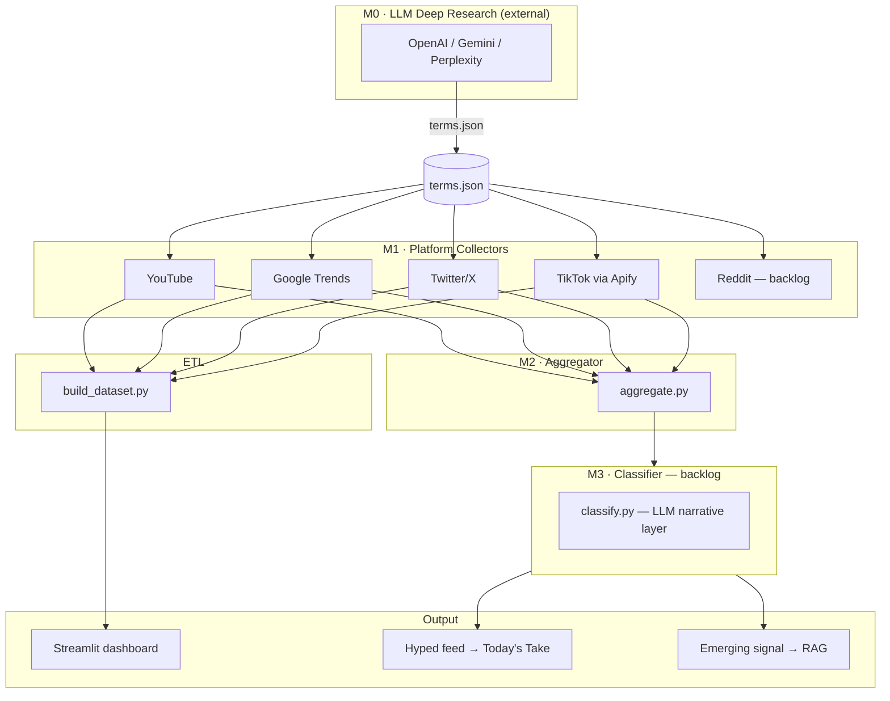
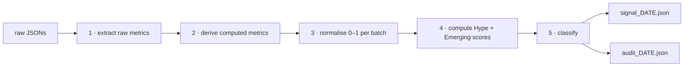
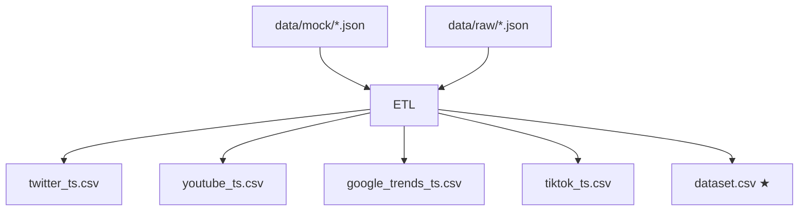
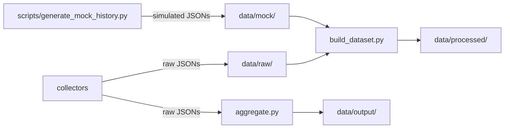
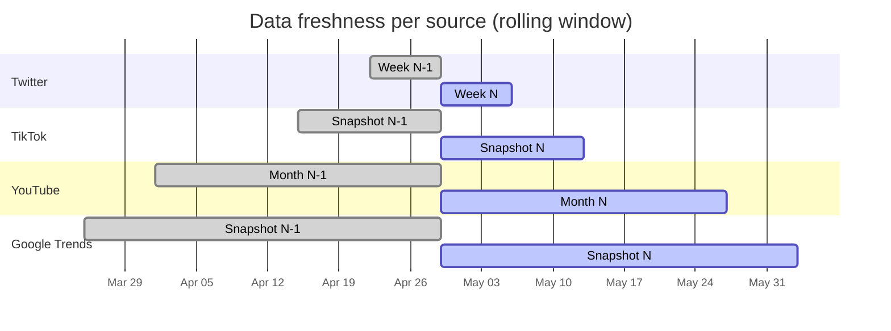

# Architecture — Mini-RAG

Mini-RAG validates whether health trend terms (surfaced by external LLM deep research) are actually trending on social platforms, then routes them into EverMe's two-track content system.

---

## Two-track output model

Every term that passes through the pipeline gets classified into one of two tracks — or both.

| Track | Signal | Window | Destination | Lifecycle |
|-------|--------|--------|-------------|-----------|
| **Hyped** | Sudden velocity spike | 90 days | Today's Take / chat | Ephemeral |
| **Emerging** | Sustained growth | 365 days | Foundational RAG | Persistent |

A term can be both simultaneously (`HYPED + EMERGING`). A term with insufficient data across platforms stays `UNCLASSIFIED`. See `docs/aggregation_plan.md` for the full classification decision tree.

---

## Pipeline overview



---

## Component breakdown

### M1 — Collectors (`collectors/`)

Each collector runs independently, writes one JSON file to `data/raw/`, and is designed to be re-run on a schedule.

| Collector | Source | Window | Key metrics | Cadence |
|-----------|--------|--------|-------------|---------|
| `youtube.py` | YouTube Data API v3 | 90d + 365d | `avg_vpd`, `top_vpd` per window | Monthly |
| `google_trends.py` | pytrends (free) | 90d + 365d | `velocity`, `current_score`, `avg_score` | ~6 weeks |
| `twitter.py` | Twitter API v2 Basic | 7d | `avg_retweets`, `avg_likes`, `tweet_count` | Weekly |
| `tiktok.py` | Apify `clockworks/tiktok-scraper` | Snapshot | `avg_plays`, `avg_shares`, `avg_diggs` | Bi-weekly |

All collectors read from `data/terms.json` (generated by `ingest_deep_research.py`) via `--terms data/terms.json`, falling back to `data/mock/terms.json` for development. Output goes to `data/raw/<source>_YYYY-MM-DD.json`.

**Search strategy per collector:**

| Collector | Uses `social_trend_name` | Uses `related_terms` | Strategy |
|-----------|--------------------------|----------------------|----------|
| `youtube.py` | ✓ primary query | ✓ one `search.list` call each | All queries pooled, deduplicated by video ID |
| `google_trends.py` | ✓ only query | ✗ ignored | Single pytrends call per term per window |
| `twitter.py` | ✓ primary query | ✓ one search call each | All queries pooled, deduplicated by tweet ID |
| `tiktok.py` | ✓ only query | ✗ ignored | Single batch Apify job across all terms |

YouTube and Twitter run one API call per query (social_trend_name + each related_term) and deduplicate results by ID before aggregating metrics. Google Trends and TikTok use only `social_trend_name` — Google Trends because pytrends accuracy degrades with multi-keyword queries; TikTok because Apify batches all terms in one job keyed by the main name.

**YouTube quota note:** each `search.list` = 100 units. With 26 terms × (1 + avg 2 related_terms) × 2 sort orders = ~15,600 units/run against a 10,000/day limit. Keep `related_terms` to 1–2 items per term or run on consecutive days splitting the batch.

YouTube makes a single 365d search pass per term; the 90d window is derived by filtering `published_at`, avoiding doubled API quota. Twitter recomputes `start_time` fresh per term to avoid the 7-day boundary drifting during a run.

### M2 — Aggregator (`pipeline/aggregate.py`)

Reads the four latest raw JSON files (or specific paths via `--date` or explicit flags), computes two scores per term, and classifies each.



**Normalisation** is relative to the current batch: the strongest term on each dimension scores 1.0, the weakest 0.0. Scores are not comparable across runs — use the classification label for cross-run comparisons.

**Scoring inputs and weights:**

| Metric | Hype (0.20–0.25) | Emerging (0.15–0.35) |
|--------|-----------------|---------------------|
| `tt_avg_shares` | 0.25 | — |
| `tw_avg_retweets` | 0.20 | — |
| `gt_velocity_90d` | 0.20 | — |
| `gt_above_baseline` | 0.20 | — |
| `yt_peak_ratio` | 0.15 | — |
| `gt_velocity_365d` | — | 0.35 |
| `gt_avg_365d` | — | 0.30 |
| `yt_avg_vpd_365d` | — | 0.20 |
| `tt_avg_plays` | — | 0.15 |

Weights re-normalise automatically when inputs are null (missing source data). A term needs data from at least 2 platforms to receive a classification; otherwise it is `UNCLASSIFIED`.

Outputs two files to `data/output/`:
- `signal_YYYY-MM-DD.json` — lean operational payload: classification, scores, `signal_drivers` (top 2-3 metrics driving the dominant score), `routed_to` (list of destination strings).
- `audit_YYYY-MM-DD.json` — full detail: same envelope plus `raw_metrics`, `derived_metrics`, `normalised`.

### ETL (`pipeline/build_dataset.py`)

Flattens all collector JSONs (both mock and real) into analysis-ready CSV tables. Runs independently of M2 — the two pipelines share raw JSON inputs but produce separate outputs.



**`dataset.csv`** is the primary output: one row per `(term × week)`, all four sources joined via as-of (forward-fill) merge onto a weekly timeline. Lower-cadence sources (YouTube, Google Trends) carry a `*_collected` column recording which snapshot date was used. The dashboard uses this table for time-series charts and live score recomputation.

Per-source tables (`*_ts.csv`) are kept at their natural cadence for raw inspection.

Real data overwrites mock for the same `(term_id, date)` pair. `is_mock` is `1` when all contributing sources are from `data/mock/`.

### M3 — Classifier (`pipeline/classify.py` — backlog)

Planned as a thin LLM layer on top of M2 output. M2 handles the quantitative classification; M3 adds narrative context (why this term is classified as HYPED, what the underlying topic means for EverMe users). Model choice is pending. See discussion in `docs/aggregation_plan.md`.

### Dashboard (`app/` — in progress)

Streamlit app consuming `data/processed/dataset.csv`. Three planned views:

1. **Macro view** — heatmap of all terms × scores, colour-coded by classification
2. **Term detail** — time-series per source for a selected term
3. **Threshold panel** — sliders for hype/emerging thresholds; classification updates live

---

## Data storage



| Directory | Contents | Versioned |
|-----------|----------|-----------|
| `data/mock/` | `terms.json` + 6 months of simulated history (66 JSON files) | Yes |
| `data/raw/` | Real collector outputs (`*.json`) | No — gitignored |
| `data/processed/` | ETL CSVs — `dataset.csv` + per-source tables | No — gitignored |
| `data/output/` | M2 aggregator output — `signal_*.json` + `audit_*.json` | No — gitignored |
| `reports/` | Local analysis outputs | No — gitignored |

Raw and processed files are not committed. The mock data in `data/mock/` is committed and serves as the development dataset. When real data accumulates in GCS, the ETL will be updated to read from there.

---

## Collection cadences



The ETL forward-fills slower sources to align them with the weekly Twitter cadence. The `*_collected` columns in `dataset.csv` record the staleness of each source for any given week.

---

## Key data contracts

### Input: `terms.json`

```json
{
  "id": "wolverine-stack",
  "social_trend_name": "Wolverine Stack",
  "underlying_topic": "Peptides",
  "everme_category": "Supplements",
  "related_terms": ["BPC-157 TB-500", "wolverine protocol peptides", "peptide healing stack"]
}
```

`social_trend_name` is used as the search query across all platforms. `related_terms` are additional queries for YouTube and Twitter to broaden signal capture. `underlying_topic` is what surfaces in the EverMe UI — not the trend name itself.

### Raw collector output envelope

All four collectors share the same top-level envelope:

```json
{
  "source": "twitter",
  "collected_at": "2026-04-29T14:00:00Z",
  "term_count": 12,
  "terms": [ ... ]
}
```

Each `terms[i]` entry contains `term_id`, `social_trend_name`, `underlying_topic`, `everme_category`, and source-specific metrics. See `docs/etl_plan.md` for the per-source field reference.

---

## Development setup

```bash
# Install dependencies
pip install -r requirements.txt

# Copy and fill credentials
cp .env.example .env

# Run collectors (real data — costs quota/money)
python collectors/youtube.py
python collectors/google_trends.py
python collectors/twitter.py
python collectors/tiktok.py        # ~$0.60/run

# Or use the 6-month mock dataset already in data/mock/
python scripts/generate_mock_history.py   # regenerate if needed

# Run M2 aggregator on real data
python pipeline/aggregate.py

# Build analysis dataset (mock + real)
python pipeline/build_dataset.py

# Output → data/processed/dataset.csv
```

---

## Document map

| Document | What it covers |
|----------|---------------|
| `CLAUDE.md` | Instructions for Claude Code sessions — conventions, current milestone, env vars |
| `ARCHITECTURE.md` | This file — system design, data flow, component breakdown |
| `docs/macro_plan.md` | Task table and full pipeline Mermaid diagram |
| `docs/aggregation_plan.md` | M2 methodology — formulas, weights, scoring, classification logic |
| `docs/etl_plan.md` | ETL pipeline — schema, cadence, forward-fill logic, column reference |
| `docs/youtube_plan.md` | YouTube collector spec |
| `docs/google_trends_plan.md` | Google Trends collector spec |
| `docs/twitter_plan.md` | Twitter/X collector spec |
| `docs/tiktok_instagram_plan.md` | TikTok collector spec |
| `docs/reddit_plan.md` | Reddit collector spec (backlog) |
