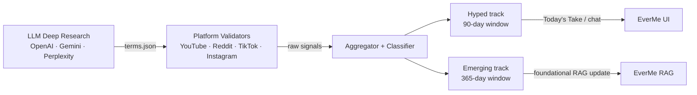

# Mini-RAG — trend intelligence for EverMe

Pipeline that validates whether health trends are gaining traction on social platforms, producing a two-track signal: **hyped** terms for Today's Take / chat, and **emerging** terms that reinforce EverMe's foundational RAG.

## How it works

External LLM research (OpenAI, Gemini, Perplexity) surfaces candidate terms with their social name and underlying topic. Mini-RAG takes those terms, queries each platform with the actual language users use, measures trending signals, and classifies each term.



## Two-track system

| Track | Window | Signal | Destination |
|-------|--------|--------|-------------|
| **Hyped** | 90 days | Sudden velocity spike | Today's Take, chat — ephemeral |
| **Emerging** | 365 days | Sustained growth | Foundational RAG — persistent |

Every hyped term maps to an `underlying_topic` already in the platform — hype is the surface, the foundational topic is what lives in the UI. Example: *Wolverine Stack* → Peptides → Amino Acids.

## Input: terms.json

Produced by external LLM research. Mock at `data/mock/terms.json`.

```json
{
  "id": "wolverine-stack",
  "social_trend": "Wolverine Stack",
  "underlying_topic": "Peptides",
  "everme_category": "Supplements",
  "trend_type": "hyped",
  "what_users_say": [
    "wolverine stack",
    "wolverine protocol BPC-157",
    "wolverine healing stack peptides"
  ]
}
```

`what_users_say` is the key field — it contains the actual search language people use, which is often different from the formal term name.

## Output: per-term trending signal

```json
{
  "term_id": "wolverine-stack",
  "social_trend": "Wolverine Stack",
  "underlying_topic": "Peptides",
  "trend_type": "hyped",
  "window": "90d",
  "video_count": 23,
  "total_views": 4820000,
  "avg_views_per_day": 18400,
  "top_views_per_day": 48000,
  "videos": [ ... ]
}
```

## Quickstart

```bash
python -m venv .venv && source .venv/bin/activate
pip install -r requirements.txt

# validate all terms in mock list
python collectors/youtube.py

# force a specific window for all terms
python collectors/youtube.py --window 30d

# use a custom terms file
python collectors/youtube.py --terms path/to/terms.json
```

## Repo layout

```
trend-radar/
├── collectors/
│   └── youtube.py          # YouTube validator (live)
├── pipeline/
│   ├── filter.py            # LLM health-relevance filter (backlog)
│   ├── normalise.py         # Cross-platform aggregator (backlog)
│   └── score.py             # Trend classifier (backlog)
├── data/
│   ├── mock/terms.json      # Mock input — edit freely
│   ├── raw/                 # Raw collector outputs (gitignored)
│   └── processed/           # Aggregated + classified outputs (gitignored)
├── docs/
│   ├── macro_plan.md        # Full pipeline plan
│   ├── youtube_plan.md      # YouTube validator spec
│   └── reddit_plan.md       # Reddit validator spec
├── .env                     # Credentials — NOT committed
├── .env.example             # Template
├── requirements.txt
├── CLAUDE.md
└── README.md
```

## Environment variables

```bash
cp .env.example .env
# fill in your keys — see .env.example for where to get each one
```
