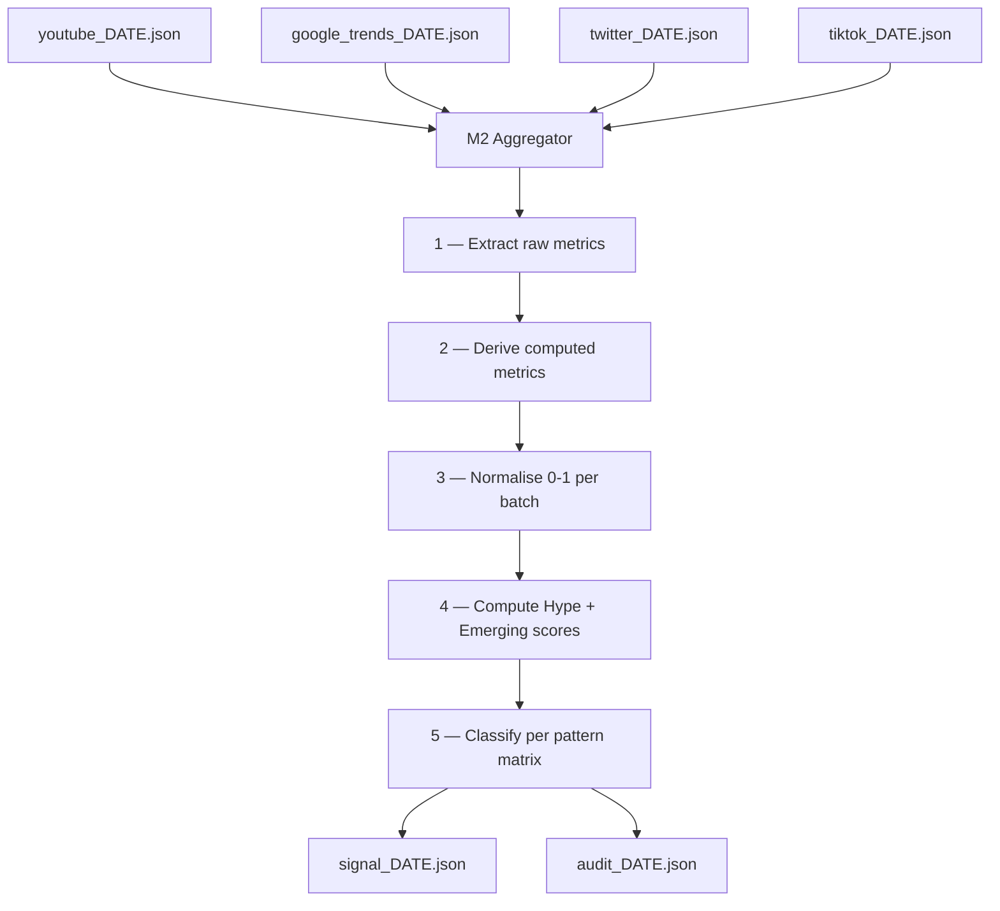
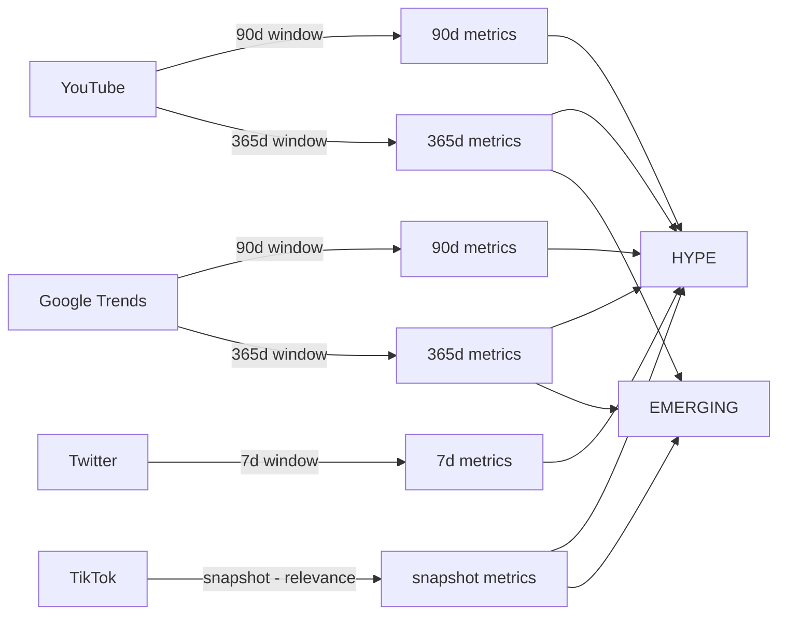
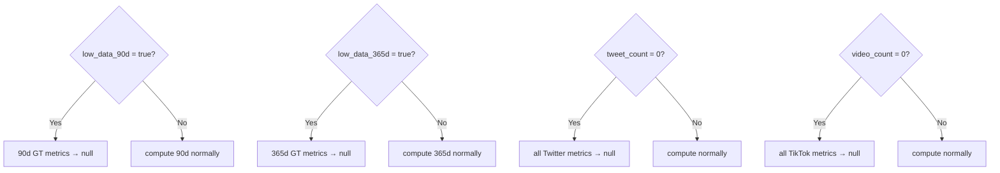
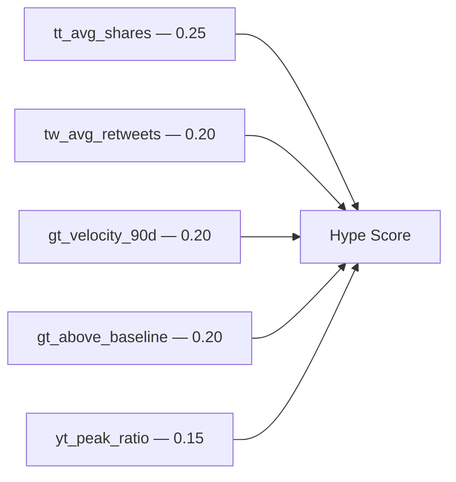
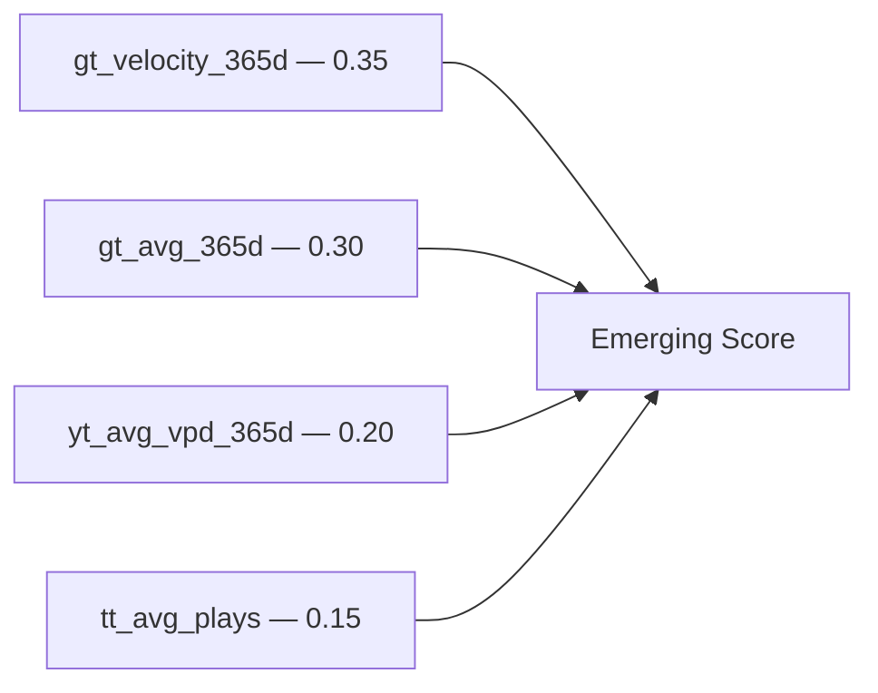
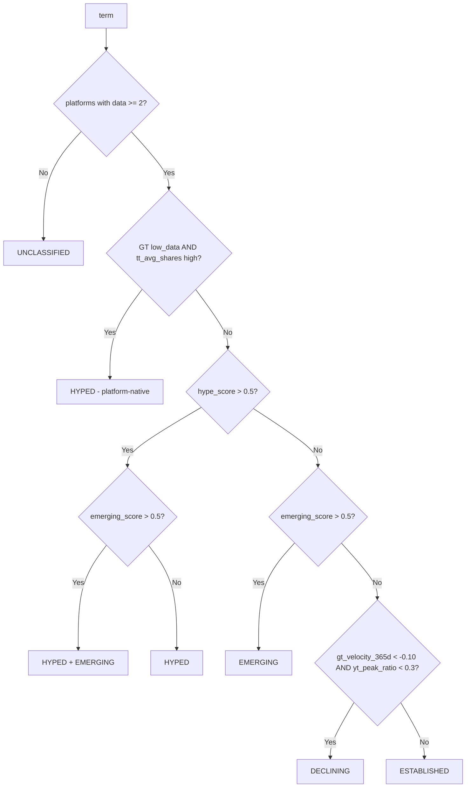

# M2 — Aggregator: Methodology & Data Flow

`pipeline/aggregate.py` — implemented.

---

## Overview

M2 reads the four raw collector outputs, extracts and derives metrics per term, normalises everything to a 0–1 scale relative to the current batch, computes two independent scores (Hype and Emerging), and classifies each term. Output feeds M3 for final labelling and routing.

---

## Pipeline overview



---

## Data sources and windows



---

## Step 1 — Raw metrics

All fields extracted directly from the JSON files with no computation.

### YouTube (`youtube_DATE.json → terms[i].windows`)

| Field | JSON path | Used for |
|-------|-----------|----------|
| `yt_top_vpd_90d` | `windows.90d.top_views_per_day` | Hype |
| `yt_top_vpd_365d` | `windows.365d.top_views_per_day` | Emerging |
| `yt_avg_vpd_90d` | `windows.90d.avg_views_per_day` | Hype |
| `yt_avg_vpd_365d` | `windows.365d.avg_views_per_day` | Emerging |

### Google Trends (`google_trends_DATE.json → terms[i].windows`)

| Field | JSON path | Used for |
|-------|-----------|----------|
| `gt_velocity_90d` | `windows.90d.velocity` | Hype |
| `gt_current_90d` | `windows.90d.current_score` | Hype |
| `gt_peak_date_90d` | `windows.90d.peak_date` | Hype |
| `gt_velocity_365d` | `windows.365d.velocity` | Emerging |
| `gt_avg_365d` | `windows.365d.avg_score` | Emerging |
| `gt_low_data` | combined flag: `90d.low_data AND 365d.low_data` | Flag — `True` only when **both** windows lack data |

Note: the code evaluates `low_data` per window independently (`gt_low_90`, `gt_low_365`) to null each window's metrics separately. The combined `gt_low_data` flag in `raw_metrics` is `True` only when both windows are empty and drives the platform-native hype rule.

### Twitter (`twitter_DATE.json → terms[i]`)

| Field | JSON path | Used for |
|-------|-----------|----------|
| `tw_avg_retweets` | `avg_retweets` | Hype |
| `tw_avg_likes` | `avg_likes` | Hype |
| `tw_top_retweets` | `top_retweets` | Hype |
| `tw_tweet_count` | `tweet_count` | Null guard |

### TikTok (`tiktok_DATE.json → terms[i]`)

| Field | JSON path | Used for |
|-------|-----------|----------|
| `tt_avg_shares` | `avg_shares` | Hype |
| `tt_top_plays` | `top_plays` | Hype |
| `tt_avg_plays` | `avg_plays` | Hype + Emerging |
| `tt_avg_diggs` | `avg_diggs` | Hype |
| `tt_avg_comments` | `avg_comments` | Emerging |

---

## Step 2 — Derived metrics

Computed from the raw fields above.

| Metric | Formula | Null condition |
|--------|---------|----------------|
| `yt_peak_ratio` | `yt_top_vpd_90d / yt_top_vpd_365d` | if `yt_top_vpd_365d = 0` |
| `yt_momentum` | `yt_avg_vpd_90d / yt_avg_vpd_365d` | if `yt_avg_vpd_365d = 0` |
| `gt_days_since_peak` | `(run_date − gt_peak_date_90d).days` | if `gt_low_data_90d = true` |
| `gt_above_baseline` | `gt_current_90d / gt_avg_365d` | if `gt_avg_365d = 0` or either low_data |

### Null rules



A `null` metric is excluded from normalisation — it does not drag other terms down. It is also excluded from the platform count used in the minimum-platforms rule.

---

## Step 3 — Normalisation

For each metric independently, across all terms in the batch:

```
normalised = (value − batch_min) / (batch_max − batch_min)
```

- Range: 0.0 to 1.0
- Terms with `null` are excluded from min/max calculation
- Terms with `null` receive `null` in the normalised value
- If all terms have the same value (max = min), normalised = 0.5 for all

This makes scores relative to the current batch — the strongest term on each dimension always scores 1.0, the weakest 0.0.

---

## Step 4 — Score composition

### Hype Score

Signals that a term is spiking **right now** — sudden, recent, spreading fast.



| Normalised input | Weight | Rationale |
|-----------------|--------|-----------|
| `tt_avg_shares` | 0.25 | Strongest real-time viral signal |
| `tw_avg_retweets` | 0.20 | Spread to influencer network |
| `gt_velocity_90d` | 0.20 | Recent search acceleration |
| `gt_above_baseline` | 0.20 | Current interest vs historical average |
| `yt_peak_ratio` | 0.15 | Current YouTube peak vs historical peak |

`hype_score = weighted average of non-null inputs` (weights re-normalised to sum to 1 when inputs are null)

### Emerging Score

Signals that a term is **growing steadily** over months — not a spike, a build.



| Normalised input | Weight | Rationale |
|-----------------|--------|-----------|
| `gt_velocity_365d` | 0.35 | Sustained directional growth |
| `gt_avg_365d` | 0.30 | High baseline = established relevance |
| `yt_avg_vpd_365d` | 0.20 | Consistent YouTube consumption over the year |
| `tt_avg_plays` | 0.15 | Platform presence beyond viral spike |

---

## Step 5 — Classification



### Classification definitions

| Label | Meaning | Destination |
|-------|---------|-------------|
| `HYPED` | Spiking now, may not last | Today's Take / chat |
| `EMERGING` | Steady long-term growth | RAG update signal |
| `HYPED + EMERGING` | Both simultaneously — at peak of a trend that's here to stay | Both tracks |
| `HYPED (platform-native)` | Viral on TikTok/Twitter but not yet on Google — early signal | Today's Take with caveat |
| `DECLINING` | Past peak, losing momentum | Drop from monitoring |
| `ESTABLISHED` | Stable, relevant, not trending | Already in RAG, no action |
| `UNCLASSIFIED` | Insufficient data | Flag for manual review |

### Threshold rationale

Initial threshold: **0.5** (median of the batch) for both scores.

In a relative system, 0.5 means "above the batch average." Starting there means roughly half the terms could qualify per track. After 2–3 monthly runs, calibrate based on how many terms are being sent to Today's Take (too many = raise threshold, too few = lower it).

### Future: per-term historical normalisation

The current batch-relative model has a structural limitation: if all 12 terms are simultaneously in low activity, half of them will still score above 0.5 and be classified as HYPED. The threshold anchors to nothing absolute.

After **4–6 real collection rounds**, revisit the scoring model with two changes:

1. **Historical normalisation** — normalise each metric against the term's own historical min/max rather than the current batch peers:
   ```
   normalised = (current - term_historical_min) / (term_historical_max - term_historical_min)
   ```
   This makes scores absolute and cross-run comparable. `hype_score = 0.8` would consistently mean "this term is in the top 20% of its own history", not "top 50% of today's batch".

2. **Empirical thresholds** — instead of a fixed 0.5, observe the historical score distribution per term and set thresholds that produce the desired classification rate (e.g. HYPED = top 20% of a term's own hype history).

The mock dataset in `data/mock/` can be used to prototype this logic, but threshold calibration requires real multi-run data — the mock trajectories are synthetic and will not produce reliable distribution estimates.

---

## Output files

Two files are written to `data/output/` on each run:

### `signal_DATE.json` — operational payload

Lean file consumed by M3 and downstream routing. One entry per term.

```json
{
  "run_date": "2026-04-29",
  "generated_at": "2026-04-29T14:00:00Z",
  "schema_version": "1.0",
  "sources": {
    "youtube": "data/raw/youtube_2026-04-29.json",
    "google_trends": "data/raw/google_trends_2026-04-29.json",
    "twitter": "data/raw/twitter_2026-04-29.json",
    "tiktok": "data/raw/tiktok_2026-04-30.json"
  },
  "term_count": 12,
  "thresholds": { "hype": 0.5, "emerging": 0.5 },
  "terms": [
    {
      "term_id": "wolverine-stack",
      "social_trend_name": "Wolverine Stack",
      "underlying_topic": "Peptides",
      "everme_category": "Supplements",
      "classification": "HYPED + EMERGING",
      "hype_score": 0.76,
      "emerging_score": 0.83,
      "platforms_with_data": 4,
      "signal_drivers": ["gt_velocity_365d", "gt_avg_365d", "tt_avg_shares"],
      "routed_to": ["today_take", "rag"]
    }
  ]
}
```

`signal_drivers` — top 2–3 normalised metrics by weighted contribution to the dominant score. `routed_to` — explicit list of destination strings (`today_take`, `rag`, or empty).

### `audit_DATE.json` — full detail

Same envelope as `signal_DATE.json` with `raw_metrics`, `derived_metrics`, and `normalised` added per term for traceability and debugging.

```json
{
  "terms": [
    {
      "term_id": "wolverine-stack",
      "classification": "HYPED + EMERGING",
      "hype_score": 0.76,
      "emerging_score": 0.83,
      "signal_drivers": ["gt_velocity_365d", "gt_avg_365d", "tt_avg_shares"],
      "routed_to": ["today_take", "rag"],
      "raw_metrics": {
        "yt_top_vpd_90d": 50283,
        "yt_top_vpd_365d": 50283,
        "yt_avg_vpd_90d": 3100,
        "yt_avg_vpd_365d": 2400,
        "gt_velocity_90d": 0.41,
        "gt_current_90d": 86,
        "gt_velocity_365d": 0.31,
        "gt_avg_365d": 100,
        "tw_avg_retweets": 8,
        "tt_avg_shares": 12,
        "tt_avg_plays": 8200
      },
      "derived_metrics": {
        "yt_peak_ratio": 1.0,
        "yt_momentum": 1.29,
        "gt_days_since_peak": 12,
        "gt_above_baseline": 0.86
      },
      "normalised": {
        "tt_avg_shares": 0.72,
        "tw_avg_retweets": 0.61,
        "gt_velocity_90d": 0.88,
        "gt_above_baseline": 0.65,
        "yt_peak_ratio": 0.90,
        "gt_velocity_365d": 0.79,
        "gt_avg_365d": 1.0,
        "yt_avg_vpd_365d": 0.55,
        "tt_avg_plays": 0.48
      }
    }
  ]
}
```

---

## Known limitations

| Limitation | Impact | Mitigation |
|------------|--------|------------|
| Relative scores shift between batches | Can't compare scores across runs | Use classification label, not score value, for cross-run comparison |
| Twitter 7d = always short window | Misses slower-moving discourse | Weight lower than TikTok; complement with Google Trends |
| TikTok sample = 10 results per term | Low statistical significance | Increase `--results-per-term` when budget allows |
| Google Trends LOW DATA | Reduces platform count | LOW DATA + TikTok strong → counts as 2 platforms for HYPED |
| YouTube video_count unreliable (API cap) | Not used in scoring | Only vpd-based metrics used |
| First run has no historical baseline | Relative scores have no reference | Calibrate thresholds after 2–3 runs |
