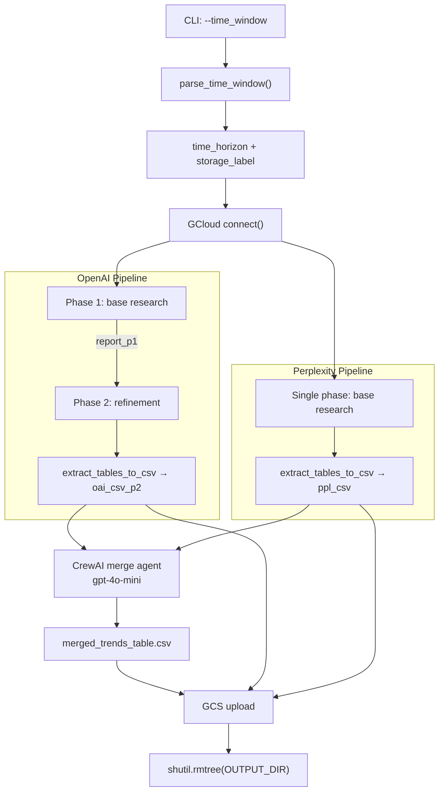
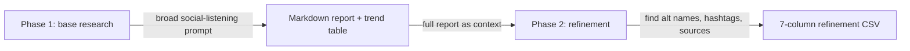
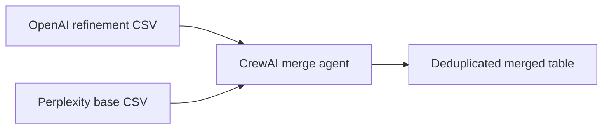

# Deep Research Pipeline — Health & Longevity Trends

Automated pipeline that discovers, refines, and merges social-first consumer health trends using OpenAI Deep Research, Perplexity Sonar Deep Research, and a CrewAI merge agent.

---

## Architecture



---

## Research design

### OpenAI — Two-phase pipeline



**Phase 1 — Discovery:** Sends a social-listening prompt scoped to the given time window. The model searches the web and returns a ranked trend table with columns like trend name, underlying topic, demand signals, and sources.

**Phase 2 — Refinement:** Receives the full phase 1 report as context and queries for alternative consumer-facing names, related search terms, hashtags, and source-backed citations for each trend. Output follows a standardised 7-column schema:

| Rank | Social trend name | Underlying topic | Related terms (clean) | Related terms with sources | Related hashtags | Key sources |

### Perplexity — Single-phase pipeline


Perplexity runs a single base research phase using Sonar Deep Research. The web search date filters are derived dynamically from the `--time_window` argument. Returns a trend table with columns: trend name, underlying topic, what users say, why trending now, demand signals, date range, and sources.

> **Why no refinement phase?** Perplexity's Sonar Deep Research inconsistently triggers web search when given a large context block in a second call. Rather than relying on non-deterministic behavior, the pipeline uses the rich base research output directly.

---

## Merge strategy



The merge agent receives both tables as markdown, deduplicates overlapping trends, preserves all unique entries, and outputs a unified table.

---

## Usage

```bash
# Last 3 months
python -m src.deep_research.deep_research_pipeline --time_window last_three_months

# Last 12 months
python -m src.deep_research.deep_research_pipeline --time_window last_twelve_months
```

| Argument | Required | Choices | Description |
|----------|----------|---------|-------------|
| `--time_window` | Yes | `last_three_months`, `last_twelve_months` | Converted to a date range (e.g. "From 2026-02-04 to 2026-05-05") injected into all prompts and Perplexity web search filters |

---

## Pipeline outputs

| File | Description |
|------|-------------|
| `deep_research_base_<date>.md` | OpenAI phase 1 full report |
| `deep_research_refinement_table_1_<date>.csv` | OpenAI phase 2 refinement table |
| `perplexity_base_<date>.md` | Perplexity base research report |
| `perplexity_base_table_1_<date>.csv` | Perplexity base trend table |
| `merged_trends_table_1_<date>.csv` | CrewAI merged table |

All files are uploaded to GCS at `gs://<MINIRAG_BUCKET>/deep_research_reports/<storage_label>/` and the local `outputs/` directory is deleted after upload.

---

## GCS storage structure

```
gs://<MINIRAG_BUCKET>/
└── deep_research_reports/
    ├── three_months/
    │   ├── deep_research_refinement_table_1_2026-05-06.csv
    │   ├── perplexity_base_table_1_2026-05-06.csv
    │   └── merged_trends_table_1_2026-05-06.csv
    └── twelve_months/
        ├── deep_research_refinement_table_1_2026-05-06.csv
        ├── perplexity_base_table_1_2026-05-06.csv
        └── merged_trends_table_1_2026-05-06.csv
```

---

## Environment variables

| Variable | Required | Description |
|----------|----------|-------------|
| `OPENAI_API_KEY` | Yes | OpenAI API key |
| `PERPLEXITY_API_KEY` | Yes | Perplexity API key |
| `MINIRAG_BUCKET` | Yes | GCS bucket name for uploads |
| `OPEN_AI_BASE_RESEARCH_MODEL` | No | Default: `o4-mini-deep-research` |
| `OPEN_AI_REFINEMENT_MODEL` | No | Default: `o4-mini-deep-research` |
| `PERPLEXITY_BASE_RESEARCH_MODEL` | No | Default: `sonar-deep-research` |
| `PERPLEXITY_API_URL` | No | Default: `https://api.perplexity.ai/v1/sonar` |
| `OUTPUT_DIR` | No | Default: `outputs` |

---

## Project structure

```
src/deep_research/
├── constants.py                    # Prompt templates (agents + user queries)
├── utils.py                        # Shared: save_markdown, extract_tables_to_csv, parse_time_window
├── deep_research_pipeline.py       # Main orchestrator (CLI entry point)
├── deep_research_test_unit.py      # Unit tests (32 tests)
├── openai/
│   ├── __init__.py
│   ├── utils.py                    # build_research_request, wait_for_response
│   └── openai_pipeline.py          # run_openai_pipeline()
├── perplexity/
│   ├── __init__.py
│   ├── utils.py                    # call_perplexity_deep_research()
│   └── perplexity_pipeline.py      # run_perplexity_pipeline()
└── crews/
    ├── __init__.py
    ├── config_loader.py            # load_yaml()
    ├── merge_pipeline.py           # run_merge_pipeline()
    └── config/
        ├── agents.yaml             # CrewAI agent definitions
        └── tasks.yaml              # CrewAI task definitions
```

---

## Known limitations

| Limitation | Impact | Mitigation |
|------------|--------|------------|
| Perplexity skips web search when given large context | Refinement phase returns empty results | Removed Perplexity phase 2; pipeline uses single-phase base research output |
| Markdown tables with trailing whitespace | `extract_tables_to_csv` regex fails to match | Normalize whitespace before regex (implemented) |
| CSVs with pipes inside cells | `pd.read_csv()` column mismatch errors | Use `read_text()` instead of `pd.read_csv().to_markdown()` for prompt injection |
| Different column schemas between providers | CrewAI merge agent may lose data | OpenAI outputs 7-column refinement schema; Perplexity outputs 9-column base schema; merge agent handles both |
| `upload_json` sets wrong content-type for CSVs | Files appear as JSON in GCS metadata | Functional but cosmetic; add `upload_csv` to GcloudConnection if needed |
