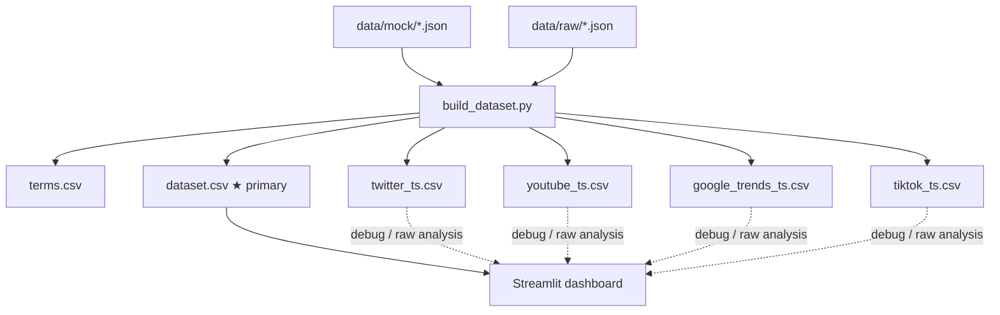
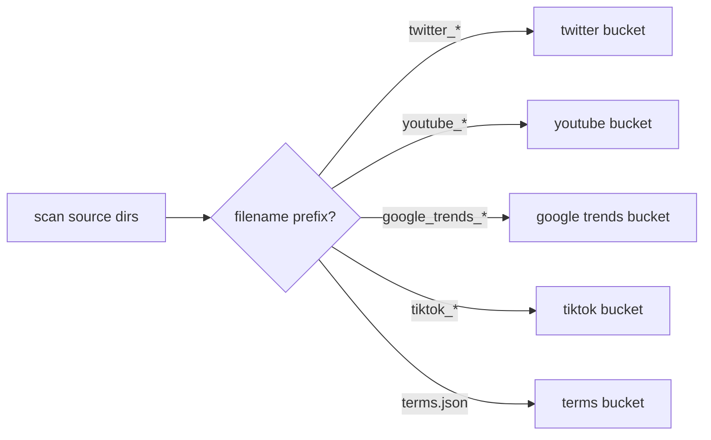
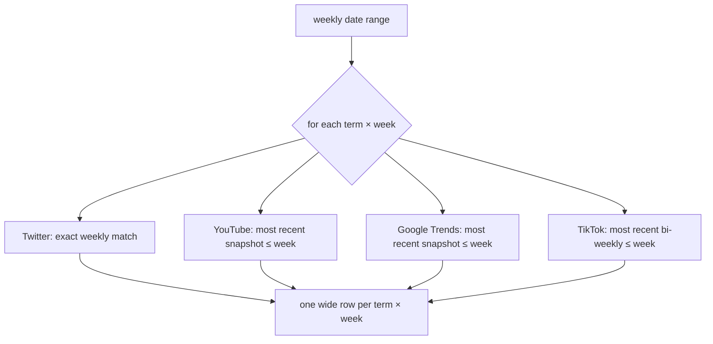
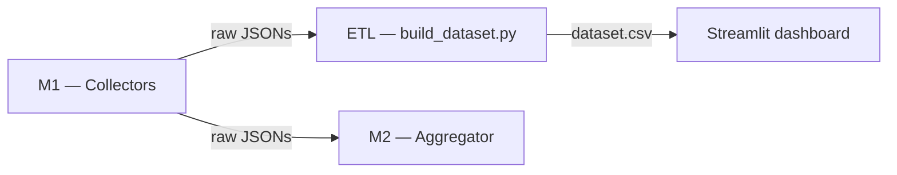

# ETL Pipeline — `pipeline/build_dataset.py`

Transforms all raw JSON collector outputs into analysis-ready CSV tables. The primary output is `dataset.csv` — a unified wide-format table consumed by the Streamlit dashboard. Per-source tables are also written for raw inspection and debugging.

---

## Overview



---

## How it works

### 1 — File discovery

Scans each source directory for JSON files matching known filename patterns (`twitter_DATE.json`, `youtube_DATE.json`, etc.). Files from `data/mock/` are tagged `is_mock=True`; files from `data/raw/` are tagged `is_mock=False`.



### 2 — Extraction

Each source has a dedicated extractor that reads the JSON, flattens nested structures, and returns rows. For example, `windows.90d.avg_views_per_day` becomes the column `avg_vpd_90d`.

### 3 — Per-source tables

Five CSVs at their natural cadence, sorted by `(term_id, collected_at)`. Real data overwrites mock for the same `(term_id, date)` pair.

### 4 — Unified dataset (`dataset.csv`)

The dashboard needs all metrics in one row to recompute scores and apply threshold sliders. Since each source has a different cadence, they are aligned onto a **weekly timeline** using as-of (forward-fill) logic.



Each source contributes a `*_collected` column recording which snapshot date was used, making the forward-fill transparent. A week in January where YouTube has no new data will show `yt_collected=2025-12-01` — the dashboard can surface this to the user.

---

## Output schema

### `terms.csv` — static reference

| Column | Description |
|--------|-------------|
| `term_id` | Slug identifier |
| `social_trend_name` | Display name |
| `underlying_topic` | Broader topic |
| `everme_category` | EverMe content category |

### `dataset.csv` — unified analysis table (primary)

One row per `(date × term_id)`. `date` is the week start, stepped weekly from the earliest to latest snapshot across all sources.

| Column group | Columns |
|-------------|---------|
| Identity | `date`, `term_id`, `social_trend_name`, `underlying_topic`, `everme_category`, `is_mock` |
| Twitter | `tw_collected`, `tw_tweet_count`, `tw_avg_retweets`, `tw_avg_likes`, `tw_top_retweets`, `tw_top_likes` |
| YouTube | `yt_collected`, `yt_avg_vpd_90d`, `yt_top_vpd_90d`, `yt_avg_vpd_365d`, `yt_top_vpd_365d` |
| Google Trends | `gt_collected`, `gt_low_data_90d`, `gt_velocity_90d`, `gt_current_90d`, `gt_avg_90d`, `gt_low_data_365d`, `gt_velocity_365d`, `gt_avg_365d` |
| TikTok | `tt_collected`, `tt_avg_plays`, `tt_top_plays`, `tt_avg_shares`, `tt_avg_diggs`, `tt_avg_comments` |

### Per-source tables

| File | Cadence | Rows (6 months, 12 terms) |
|------|---------|--------------------------|
| `twitter_ts.csv` | Weekly | ~468 |
| `youtube_ts.csv` | Monthly | ~84 |
| `google_trends_ts.csv` | ~6 weeks | ~60 |
| `tiktok_ts.csv` | Bi-weekly | ~228 |
| `dataset.csv` | Weekly (aligned) | ~312 |

---

## Column reference — `dataset.csv`

Semantics, valid ranges, and scoring role for every column. Columns marked **Hype** or **Emerging** feed into those scores in `pipeline/aggregate.py`; weights are shown in parentheses.

### Identity

| Column | Type | Description | Gotchas |
|--------|------|-------------|---------|
| `date` | YYYY-MM-DD | Week start date (canonical timeline) | Not a collection date — it's the analysis week |
| `term_id` | string | Slug (e.g. `wolverine-stack`) | Stable identifier; use this for joins, not `social_trend_name` |
| `social_trend_name` | string | Display name | May contain spaces and mixed case |
| `underlying_topic` | string | Broader topic the term belongs to | Used in EverMe UI, not in scoring |
| `everme_category` | string | Content category | Used for grouping/filtering |
| `is_mock` | int (0/1) | `1` if all contributing sources are from `data/mock/` | Stored as integer for CSV portability. Filter with `df[df.is_mock == 0]` for real data only |

### Provenance (`*_collected`)

Each source has a `*_collected` column recording the actual snapshot date used for that week via forward-fill. If `yt_collected` is two weeks older than `date`, the YouTube values reflect that older snapshot.

| Column | Meaning |
|--------|---------|
| `tw_collected` | Date of the Twitter snapshot used (always ≤ `date`) |
| `yt_collected` | Date of the YouTube snapshot used — may lag up to ~4 weeks |
| `gt_collected` | Date of the Google Trends snapshot used — may lag up to ~6 weeks |
| `tt_collected` | Date of the TikTok snapshot used — may lag up to ~2 weeks |

### Twitter columns

Window: last 7 days at collection time.

| Column | Range | Scoring role | Notes |
|--------|-------|-------------|-------|
| `tw_tweet_count` | 0 – ∞ | — | Raw volume; not normalised into scores directly |
| `tw_avg_retweets` | 0.0 – ∞ | **Hype** (0.20) | Average retweets per tweet; measures spread to networks |
| `tw_avg_likes` | 0.0 – ∞ | — | Engagement signal; not in current score formula |
| `tw_top_retweets` | 0 – ∞ | — | Peak virality of single tweet |
| `tw_top_likes` | 0 – ∞ | — | Peak engagement of single tweet |

`null` means no tweets were found for that term in the 7-day window — treat as absence of Twitter signal, not as zero engagement.

### YouTube columns

Windows: 90d and 365d from collection date. Metric: views per day (vpd), which normalises for video age.

| Column | Range | Scoring role | Notes |
|--------|-------|-------------|-------|
| `yt_avg_vpd_90d` | 0 – ∞ | — | Average vpd across all videos in the 90d window |
| `yt_top_vpd_90d` | 0 – ∞ | **Hype** (via `yt_peak_ratio`, 0.15) | Best single video's vpd in the 90d window |
| `yt_avg_vpd_365d` | 0 – ∞ | **Emerging** (0.20) | Average vpd across the full year — measures sustained consumption |
| `yt_top_vpd_365d` | 0 – ∞ | **Hype** (via `yt_peak_ratio`, 0.15) | Best single video's vpd in the 365d window |

`yt_peak_ratio = yt_top_vpd_90d / yt_top_vpd_365d`. Ratio > 1 means the current peak surpasses the historical peak — a strong recency signal.

### Google Trends columns

Google Trends scores are 0–100, relative to the term's own peak within the requested window (100 = peak week). `velocity` is computed as `(avg second half − avg first half) / 100`.

| Column | Range | Scoring role | Notes |
|--------|-------|-------------|-------|
| `gt_low_data_90d` | bool | — | `True` = Google Trends returned no meaningful data for 90d window. Treat all `gt_*_90d` values as unreliable when `True` |
| `gt_velocity_90d` | −1.0 to +1.0 | **Hype** (0.20) | Positive = accelerating; negative = decelerating. Zero = flat |
| `gt_current_90d` | 0–100 | **Hype** (via `gt_above_baseline`, 0.20) | Most recent week's interest score |
| `gt_avg_90d` | 0–100 | — | Average interest over the 90d window |
| `gt_low_data_365d` | bool | — | Same as above for the 365d window |
| `gt_velocity_365d` | −1.0 to +1.0 | **Emerging** (0.35) | Strongest single signal for long-term growth. Negative = declining trend |
| `gt_avg_365d` | 0–100 | **Emerging** (0.30) | High baseline = established search interest over the year |

`gt_above_baseline = gt_current_90d / gt_avg_365d`. Ratio > 1 means current interest exceeds the annual average — combined with positive velocity it is the clearest HYPED signal.

`fiber-maxing` has `gt_low_data_90d = gt_low_data_365d = True` — it is a TikTok-native term with no measurable Google search volume. Classification falls back to platform-native hype rules.

### TikTok columns

Snapshot-based: ~10 most relevant videos per search query at collection time.

| Column | Range | Scoring role | Notes |
|--------|-------|-------------|-------|
| `tt_avg_plays` | 0 – ∞ | **Emerging** (0.15) | Average play count across the ~10 sampled videos |
| `tt_top_plays` | 0 – ∞ | — | Play count of the single most-viewed video in the sample |
| `tt_avg_shares` | 0 – ∞ | **Hype** (0.25) | Strongest real-time viral signal in the model |
| `tt_avg_diggs` | 0 – ∞ | — | Average likes; correlated with shares but not in current formula |
| `tt_avg_comments` | 0 – ∞ | — | Engagement depth signal; not in current formula |

`null` on all TikTok columns means `video_count = 0` — no results returned for that search query. The sample size is fixed at 10 per run; absolute numbers are not comparable across terms with different organic volume.

### Score and classification (computed in `aggregate.py`, not stored in `dataset.csv`)

The dashboard recomputes these from `dataset.csv` using the formulas below.

| Score | Formula | Threshold |
|-------|---------|-----------|
| `hype_score` | Weighted avg of `tw_avg_retweets`, `gt_velocity_90d`, `gt_above_baseline`, `yt_peak_ratio`, `tt_avg_shares` | > 0.5 → HYPED |
| `emerging_score` | Weighted avg of `gt_velocity_365d`, `gt_avg_365d`, `yt_avg_vpd_365d`, `tt_avg_plays` | > 0.5 → EMERGING |

All inputs are normalised 0–1 within the batch before weighting. Weights re-normalise to sum to 1 when inputs are null. See `docs/aggregation_plan.md` for the full classification decision tree.

---

## Running

```bash
# Default: reads data/mock/ + data/raw/, writes to data/processed/
python pipeline/build_dataset.py

# Custom sources or output
python pipeline/build_dataset.py --sources data/mock data/raw --output data/processed
```

Re-run after every new collector batch. The deduplication logic makes re-running safe — for the same `(term_id, date)` pair, real data always wins over mock.

---

## Position in the pipeline



M2 (`aggregate.py`) reads raw JSONs directly for per-run scoring. The ETL runs independently and produces the longitudinal view needed by the dashboard.
