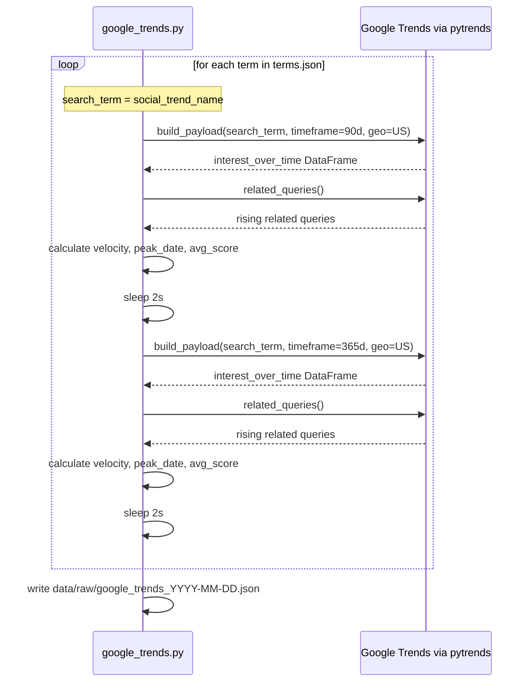

# Google Trends Validator — M1b

`collectors/google_trends.py` — implemented and ready to run.

---

## Role in Mini-RAG

Measures Google search interest for each term in `terms.json`. Answers two questions:
1. Has this term crossed into active search behavior (people opening Google and typing it)?
2. Is search interest growing, stable, or declining?

Unlike YouTube/TikTok which measure content production, Google Trends measures **demand** — people actively seeking information about the term.

---

## Access

- **Library:** `pytrends` (unofficial Python wrapper for Google Trends)
- **Credentials:** none — no API key, no account, no cost
- **Rate limiting:** Google blocks repeated requests from the same IP. For monthly runs this is not an issue. Running consecutively in the same session can trigger throttling — wait 15–30 min if all results return LOW DATA unexpectedly.

---

## Collection flow



Both windows are collected in a single run. Sleeps between each request to avoid rate limiting.

---

## Script interface

```bash
python collectors/google_trends.py                        # default: data/mock/terms.json
python collectors/google_trends.py --terms real.json
python collectors/google_trends.py --sleep 5              # safer for consecutive runs
python collectors/google_trends.py --output custom.json
```

| Argument | Default | Description |
|----------|---------|-------------|
| `--terms` | `data/mock/terms.json` | Input terms JSON |
| `--output` | `data/raw/google_trends_DATE.json` | Output path |
| `--sleep` | `2` | Seconds between requests — increase to `5` if rate limited |

`--query-field` and `--window` are not available — both windows always run using `social_trend_name`.

---

## Output structure

```json
{
  "source": "google_trends",
  "collected_at": "2026-04-29T14:00:00Z",
  "windows": ["90d", "365d"],
  "term_count": 12,
  "terms": [
    {
      "term_id": "cold-plunge",
      "social_trend_name": "Cold Plunge",
      "underlying_topic": "Cold Thermogenesis",
      "everme_category": "Wellness Therapies",
      "search_term_used": "Cold Plunge",
      "windows": {
        "90d": {
          "low_data": false,
          "current_score": 43,
          "avg_score": 38,
          "peak_score": 100,
          "peak_date": "2026-02-09",
          "velocity": 0.11,
          "interest_over_time": [
            { "date": "2026-01-27", "score": 31 },
            { "date": "2026-04-27", "score": 43 }
          ],
          "rising_queries": ["cold plunge benefits", "cold plunge at home"]
        },
        "365d": {
          "low_data": false,
          "current_score": 43,
          "avg_score": 52,
          "peak_score": 100,
          "peak_date": "2025-12-01",
          "velocity": -0.14,
          "interest_over_time": [ "..." ],
          "rising_queries": ["cold plunge benefits", "cold plunge tub"]
        }
      }
    }
  ]
}
```

---

## Metrics explained

### Score (0–100)

Google Trends normalizes scores **relative to the peak within the requested period**. The peak = 100; everything else is proportional. This means:

- You cannot compare absolute search volumes between different terms
- You CAN compare trends within the same term over time
- You CAN compare velocity and trajectory across terms

| Metric | What it means |
|--------|---------------|
| `current_score` | Search interest in the most recent complete week (relative to period peak) |
| `avg_score` | Average interest across the entire window — how sustained the term is |
| `peak_score` | Always 100 if the peak fell within this window |
| `peak_date` | When search interest was highest in the period |

### Velocity (−1.0 to +1.0)

```
velocity = (avg_score second half − avg_score first half) / 100
```

| Value | Meaning |
|-------|---------|
| > +0.20 | Strongly growing |
| +0.05 to +0.20 | Gently growing |
| −0.05 to +0.05 | Stable |
| −0.05 to −0.20 | Declining |
| < −0.20 | Fading fast — likely past its peak |

### Comparing 90d vs 365d windows

| 90d velocity | 365d velocity | Interpretation |
|-------------|---------------|----------------|
| Positive | Positive | Sustained growth — term is building |
| Positive | Negative | Recovery after a dip — may be cyclical |
| Negative | Positive | Recent pullback from long-term growth |
| Negative | Negative | Declining across both timeframes |

### `peak_date` interpretation

| peak_date | Meaning |
|-----------|---------|
| Last 2 weeks | Term is at or near peak right now |
| 1–2 months ago | Peaked recently, may still have momentum |
| More than 3 months ago (in 90d window) | Peak has passed — declining |
| Beginning of the 365d window | Established term, not currently trending |

### `low_data` flag

`low_data: true` means one of two things:

1. **Platform-native term** — lives on TikTok/YouTube, people don't Google it. Expected and informative.
2. **Rate limiting** — Google blocked the request after consecutive runs. If well-known terms like "Red Light Therapy" return `low_data`, wait 15–30 minutes and re-run.

### `rising_queries`

Related searches growing faster than average. Useful for discovering new search phrases and identifying sub-topics gaining traction. These can inform future `related_terms` additions to `terms.json`.

---

## Known limitations

| Limitation | Impact | Mitigation |
|------------|--------|------------|
| Scores are relative, not absolute | Can't compare volume between terms | Use `velocity` and `peak_date` for cross-term comparison |
| Rate limiting from pytrends | All LOW DATA after consecutive runs | Wait 15–30 min; use `--sleep 5` |
| LOW DATA for platform-native terms | No signal for TikTok-origin trends | Expected — YouTube/TikTok collectors fill this gap |
| US geo only | Misses non-US trends | Acceptable for EverMe's primary market |
| Weekly granularity | Can't detect day-level spikes | Acceptable for monthly runs |
| 2 API calls per term | 24 calls for 12 terms | Sleep between calls keeps rate limits safe |
