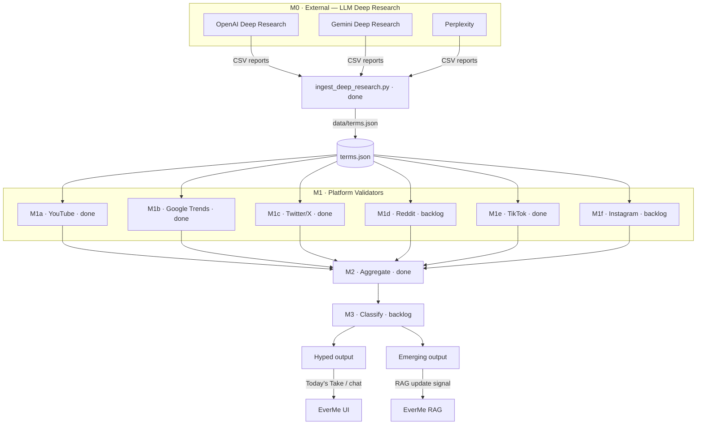
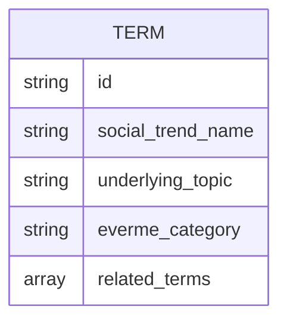

# Macro Plan — Mini-RAG

Full pipeline design, task breakdown, and execution order.

---

## Architecture



---

## Two-track system

| Track | Window | Signal | Destination | Lifecycle |
|-------|--------|--------|-------------|-----------|
| **Hyped** | 90 days | Sudden velocity spike | Today's Take, chat | Ephemeral |
| **Emerging** | 365 days | Sustained growth | Foundational RAG | Persistent |

Every hyped term maps to an `underlying_topic` already in the platform:

```
Wolverine Stack  →  Peptides       →  Amino Acids
Fiber-maxing     →  Dietary Fiber  →  Nutrition
Cortisol Face    →  Cortisol       →  Stress Hormones
```

---

## Task table

| Task | Description | Status | Credentials needed |
|------|-------------|--------|-------------------|
| M0 | LLM deep research → terms.json | mocked | — |
| M1a | YouTube validator | **done** | `YOUTUBE_DATA_API_KEY` ✓ |
| M1b | Google Trends validator | **done** | none (pytrends) ✓ |
| M1c | Twitter/X validator | **done** | `TWITTER_BEARER_TOKEN` ✓ |
| M1d | Reddit validator | backlog | `REDDIT_CLIENT_ID/SECRET` |
| M1e | TikTok validator | **done** | `APIFY_API_TOKEN` ✓ |
| M1f | Instagram validator | backlog | `APIFY_API_TOKEN` |
| M2 | Cross-platform aggregator | **done** | — |
| M3 | Classifier: hyped vs emerging | backlog | `ANTHROPIC_API_KEY` |
| M4 | Output: Today's Take feed + RAG signal | backlog | — |

---

## Input: terms.json schema



| Field | Description |
|-------|-------------|
| `id` | Slug identifier (`wolverine-stack`) |
| `social_trend_name` | Viral name as it circulates on social platforms — primary search query |
| `underlying_topic` | Foundational concept that lives in the RAG |
| `everme_category` | EverMe content category |
| `related_terms` | Additional search phrases (synonyms, branded names, sub-topics) — used as extra queries |

No `trend_type` in input — M2/M3 classify hyped vs emerging from the raw data. Mock at `data/mock/terms.json`. Replace with real output from M0 research.

---

## Collector interface (all validators share this pattern)

```bash
python collectors/<platform>.py [--terms data/mock/terms.json] [--output data/raw/<platform>_DATE.json]
```

Each collector loads `terms.json`, queries the platform using `social_trend_name` + `related_terms`, runs its available windows, and writes a per-term signal JSON. Windows collected per platform:

| Platform | Windows in output |
|----------|-------------------|
| YouTube | `90d`, `365d` (single search pass) |
| Google Trends | `90d`, `365d` (two API calls per term) |
| Twitter/X | `7d` (Basic tier limit) |
| Reddit | `90d`, `365d` (planned) |
| TikTok | `90d`, `365d` (planned via Apify) |

---

## Platform coverage per track

| Platform | Hyped (90d) | Emerging (365d) | Notes |
|----------|-------------|-----------------|-------|
| YouTube | ✓ | ✓ | Full window support |
| Google Trends | ✓ | ✓ | Full window support |
| Twitter/X | ✓ | ✗ | Basic tier — 7d only |
| Reddit | ✓ | ✓ | Full window via search |
| TikTok | ✓ | ✓ | Via Apify |
| Instagram | ✓ | ✓ | Via Apify |

---

## Platform signal summary

| Platform | Key metric | What it measures |
|----------|-----------|-----------------|
| YouTube | `top_views_per_day` | Content velocity — how fast videos are being consumed |
| Google Trends | `velocity` + `current_score` | Search intent — are people actively looking this up? |
| Twitter/X | `avg_retweets` + `tweet_count` | Real-time pulse — what's being discussed this week |
| Reddit | `avg_score` + `subreddits_found` | Community depth — discussion quality and breadth |
| TikTok | `avg_share_count` | Viral reach — passive consumption at scale |
| Instagram | `avg_like_count` | Lifestyle adoption — mainstream aesthetic signal |

---

## M2 — Cross-platform aggregator

Merges per-platform JSONs into one record per term:

```json
{
  "term_id": "wolverine-stack",
  "social_trend_name": "Wolverine Stack",
  "underlying_topic": "Peptides",
  "platform_count": 4,
  "platforms": {
    "youtube":       { "90d": { "video_count": 23, "top_views_per_day": 48000 }, "365d": { "video_count": 87, "top_views_per_day": 52000 } },
    "google_trends": { "90d": { "current_score": 62, "velocity": 0.41 }, "365d": { "current_score": 55, "velocity": 0.18 } },
    "twitter":       { "7d": { "tweet_count": 312, "avg_retweets": 84 } },
    "reddit":        { "90d": { "post_count": 41, "avg_score": 840 }, "365d": { "post_count": 180, "avg_score": 620 } }
  }
}
```

`platform_count` is the key diversity signal — a term trending on 4 platforms simultaneously is a strong validated trend.

---

## External setup still needed

| Credential | Where | Env var | Blocks |
|------------|-------|---------|--------|
| Reddit OAuth app | reddit.com/prefs/apps → script type | `REDDIT_CLIENT_ID`, `REDDIT_CLIENT_SECRET` | M1d |
| Apify token | apify.com → Settings → Integrations | `APIFY_API_TOKEN` | M1e, M1f |
| Anthropic key | console.anthropic.com | `ANTHROPIC_API_KEY` | M3 |

Google Trends: no credentials needed (pytrends).
Twitter/X: credentials already in `.env` ✓

---

## Phased execution

```mermaid
gantt
    title Execution phases
    dateFormat X
    axisFormat Phase %s

    section Done
    M1a YouTube          :done, 0, 1
    M1b Google Trends    :done, 0, 1
    M1c Twitter          :done, 0, 1

    section Next
    M1d Reddit           :1, 2
    M2 Aggregator v1     :2, 3

    section Later
    M1e TikTok           :3, 4
    M1f Instagram        :3, 4
    M3 Classifier        :4, 5
    M4 Output formatter  :5, 6
```


