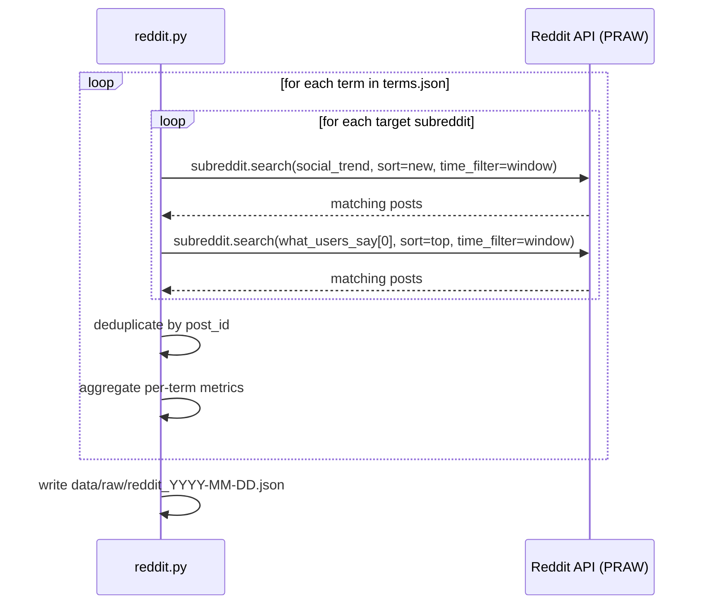

# Reddit Validator — M1d

`collectors/reddit.py` — backlog. Pending Reddit OAuth app credentials.

---

## Role in Mini-RAG

Measures discussion depth and community engagement for each term in `terms.json`. Reddit is the platform where health topics get dissected with cited sources and first-hand experiment reports. High Reddit activity signals a term has moved beyond casual awareness into active community investigation.

---

## Access

- **Library:** `praw` — Python Reddit API Wrapper
- **Auth:** OAuth app, script type (read-only, no user login)
- **Env vars:** `REDDIT_CLIENT_ID`, `REDDIT_CLIENT_SECRET`, `REDDIT_USER_AGENT`
- **Cost:** Free
- **Rate limit:** 60 requests/minute on OAuth

### Creating the Reddit app

1. Go to reddit.com/prefs/apps
2. Click "create another app"
3. Type: **script**
4. Redirect URI: `http://localhost:8080` (required but unused)
5. Copy `client_id` (shown under the app name) and `client_secret`

---

## Collection strategy

Unlike YouTube where we run queries per `what_users_say` variant, Reddit search works best with the term name directly. We search each subreddit for the `social_trend` name and its first `what_users_say` variant, then aggregate.

Subreddits to search:

| Subreddit | Why |
|-----------|-----|
| r/longevity | Anti-aging research, supplement protocols |
| r/biohacking | Self-experimentation, early adopter community |
| r/ScientificNutrition | Evidence-based, cites studies |
| r/nutrition | Broader community, mainstream adoption signal |
| r/intermittentfasting | Metabolic health overlap |
| r/Nootropics | Cognitive enhancement, peptide crossover |
| r/Peptides | Direct overlap with many Mini-RAG terms |

---

## Collection flow



---

## Output structure

```json
{
  "source": "reddit",
  "collected_at": "2026-04-29T14:00:00Z",
  "term_count": 12,
  "terms": [
    {
      "term_id": "wolverine-stack",
      "social_trend": "Wolverine Stack",
      "underlying_topic": "Peptides",
      "trend_type": "hyped",
      "window": "90d",
      "post_count": 41,
      "total_score": 18240,
      "avg_score": 445,
      "top_score": 3200,
      "avg_upvote_ratio": 0.94,
      "avg_comment_count": 67,
      "subreddits_found": ["Peptides", "biohacking", "longevity"],
      "posts": [
        {
          "post_id": "t3_abc123",
          "subreddit": "Peptides",
          "title": "6-week Wolverine Stack log — BPC-157 + TB-500",
          "flair": "Experiment Log",
          "score": 3200,
          "upvote_ratio": 0.97,
          "num_comments": 183,
          "created_utc": "2026-03-14T09:12:00Z",
          "url": "https://reddit.com/r/Peptides/comments/abc123/",
          "selftext_snippet": "Starting my Wolverine Stack log. Week 1..."
        }
      ]
    }
  ]
}
```

---

## Metrics explained

### Term-level metrics

| Metric | What it means |
|--------|---------------|
| `post_count` | Volume of discussion — how many posts mention this term in the window |
| `avg_score` | Average community upvotes — quality signal, higher = more validated by community |
| `top_score` | Most upvoted single post — identifies anchor content driving awareness |
| `avg_upvote_ratio` | Controversy signal — ratio below 0.80 means the community is divided on the term |
| `avg_comment_count` | Engagement depth — high comments = people have a lot to say (positive or negative) |
| `subreddits_found` | Which communities are discussing it — breadth signal |

### Reading the signals

**Term has strong Reddit signal if:**
- `post_count` ≥ 5 in the window
- `avg_score` > 200 (community is upvoting the content)
- `avg_upvote_ratio` > 0.85 (community consensus, not controversy)
- `subreddits_found` has 2+ different communities

**Interpretation nuances:**
- High `avg_comment_count` + low `avg_upvote_ratio` = controversial — community is debating the term, not endorsing it. Could still be trending.
- Posts with `flair` like "Experiment Log" or "Research" in r/Peptides or r/biohacking = high-quality signal — real self-experimenters
- `post_count` concentrated in one subreddit = niche. Spread across 3+ = crossing communities = stronger trend signal

### `subreddits_found` as a diversity signal

A term appearing in r/Peptides only means one thing. The same term appearing in r/Peptides, r/biohacking, AND r/ScientificNutrition means the community is both experimenting with it and researching it — much stronger signal.

---

## Known limitations

| Limitation | Impact | Mitigation |
|------------|--------|------------|
| Reddit search is not full-text across all posts | May miss posts that don't use the exact term | Multiple `what_users_say` variants as queries |
| `.search()` returns max ~1000 results | May not cover full 365d window on active subs | Acceptable for monthly trend validation |
| Score is dynamic (changes over time) | Score at collection ≠ final score | Consistent monthly collection, not real-time |
| Deleted posts not returned | Gaps in controversial content | Acceptable |
