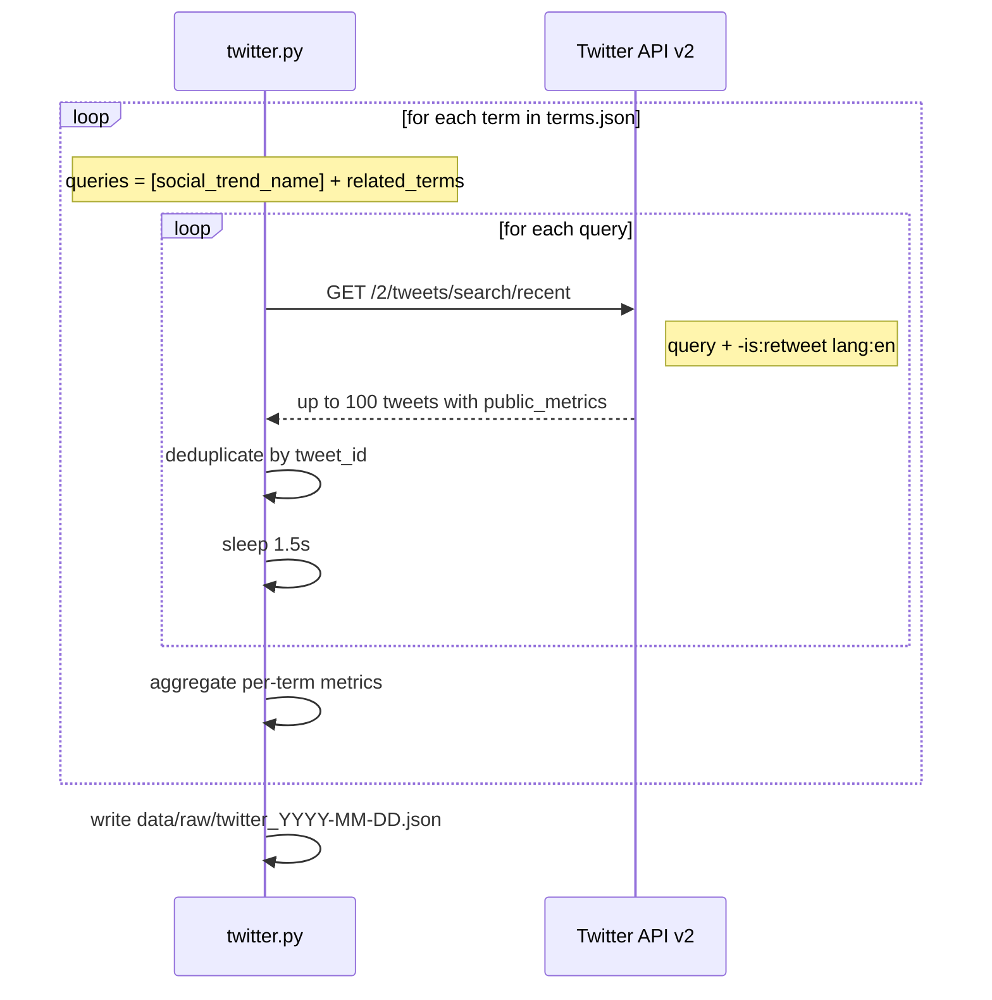

# Twitter/X Validator — M1c

`collectors/twitter.py` — implemented and ready to run.

---

## Role in Mini-RAG

Measures real-time conversation volume and engagement for all terms. Twitter/X is the pulse of what's being discussed right now — not content produced (YouTube) or searched (Google Trends), but active public discourse.

**Constraint:** Basic tier API access limits search to the last 7 days. This is a fixed window — M2 and M3 interpret the signal, not the collector.

---

## Access

- **API:** Twitter API v2 — app-only auth (Bearer token)
- **Env var:** `TWITTER_BEARER_TOKEN`
- **Tier:** Basic — last 7 days, 500k tweet reads/month
- **No library needed:** uses `requests` directly (avoids tweepy's Python 3.13+ incompatibility)

---

## Collection flow



---

## Script interface

```bash
python collectors/twitter.py                          # default: data/mock/terms.json
python collectors/twitter.py --terms real_terms.json  # production terms
python collectors/twitter.py --output data/raw/twitter_test.json
```

| Argument | Default | Description |
|----------|---------|-------------|
| `--terms` | `data/mock/terms.json` | Input terms JSON |
| `--output` | `data/raw/twitter_YYYY-MM-DD.json` | Output path |

`--window` is not available — always 7 days (Basic tier hard limit).

---

## Output structure

```json
{
  "source": "twitter",
  "collected_at": "2026-04-29T14:00:00Z",
  "window": "7d",
  "note": "Basic tier — last 7 days only.",
  "term_count": 12,
  "terms": [
    {
      "term_id": "wolverine-stack",
      "social_trend_name": "Wolverine Stack",
      "underlying_topic": "Peptides",
      "everme_category": "Supplements",
      "queries_used": ["Wolverine Stack", "BPC-157 TB-500", "wolverine protocol peptides", "peptide healing stack"],
      "window": "7d",
      "tweet_count": 312,
      "total_likes": 18400,
      "total_retweets": 4200,
      "avg_likes": 59,
      "avg_retweets": 13,
      "top_likes": 4800,
      "top_retweets": 1200,
      "tweets": [
        {
          "tweet_id": "1234567890123456789",
          "text": "Tried the Wolverine Stack (BPC-157 + TB-500) for 8 weeks...",
          "author_id": "987654321",
          "created_at": "2026-04-25T14:30:00Z",
          "like_count": 4800,
          "retweet_count": 1200,
          "reply_count": 340,
          "quote_count": 89,
          "engagement": 6429,
          "matched_query": "Wolverine Stack"
        }
      ]
    }
  ]
}
```

---

## Metrics explained

### Term-level metrics

| Metric | What it means |
|--------|---------------|
| `tweet_count` | Volume of conversation in the last 7 days — how much is being said |
| `avg_likes` | Average positive engagement per tweet — quality of resonance |
| `avg_retweets` | Average spread — how much content is being amplified |
| `top_likes` | Most-liked tweet — identifies the anchor content driving awareness |
| `top_retweets` | Most-retweeted — identifies what's actively spreading |

### Tweet-level metrics

| Metric | What it means |
|--------|---------------|
| `like_count` | Direct positive signal |
| `retweet_count` | Amplification — content spreading to new audiences |
| `reply_count` | Conversation — high replies = people engaging or debating |
| `quote_count` | Commentary — people sharing with their own take |
| `engagement` | Sum of all four — total interaction score for ranking |

### Reading the signals

**Term has strong Twitter signal if:**
- `tweet_count` > 50 in 7 days (active conversation)
- `avg_retweets` > 10 (content spreading, not just liked)
- `top_retweets` > 100 (at least one anchor tweet with real reach)

**Nuances:**
- High `reply_count` relative to `like_count` = controversial or actively debated — still a trend signal, but the community is divided
- High `quote_count` = opinion leaders are commenting — strong amplification signal
- High `tweet_count` but low `avg_likes` = noise — many people mentioning it but without engagement

### Twitter vs YouTube for the same term

| Scenario | Twitter signal | YouTube signal | Interpretation |
|----------|---------------|----------------|----------------|
| High both | Strong | Strong | Peak of trend — already mainstream |
| High Twitter, low YouTube | Strong | Weak | Very early — Twitter first-mover, content not yet produced |
| Low Twitter, high YouTube | Weak | Strong | Trend has matured — creators made videos, discourse quieted |
| Low both | Weak | Weak | Term may be declining or was never viral |

---

## Rate limits

- **Basic tier:** 180 requests per 15 minutes (app-level)
- Script sleeps 1.5s between calls — well within limits
- 500k tweet reads/month: with 12 terms × 4 queries × 100 results = 4,800 reads per run. Monthly runs use ~4,800/500,000 of the quota.

---

## Known limitations

| Limitation | Impact | Mitigation |
|------------|--------|------------|
| 7-day window only | No historical context | Complement with YouTube + Google Trends for history |
| No full archive (Basic tier) | Can't measure trend over months | Twitter provides recency signal only |
| Filtered to English, no retweets | May miss non-English trends | Acceptable for EverMe's primary market |
| Public metrics may show 0 for some tweets | API sometimes withholds metrics | Treat 0 as unknown, not zero engagement |
