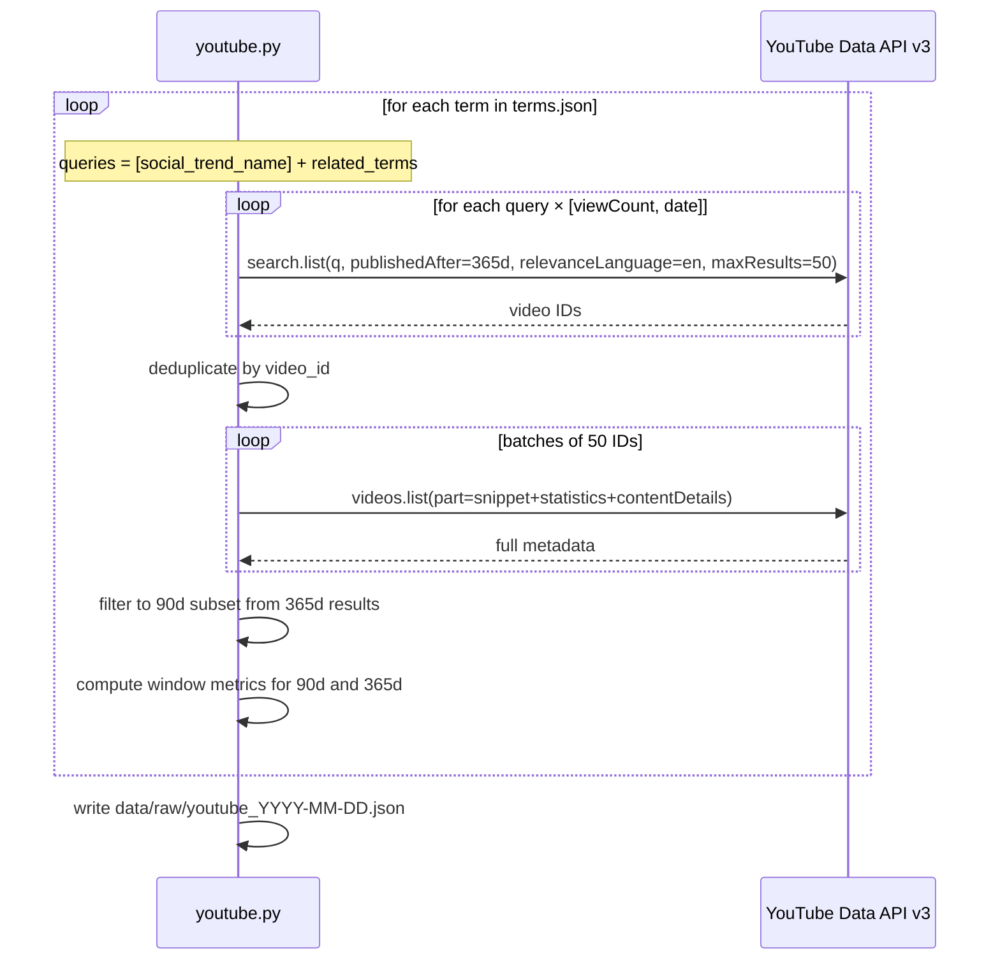
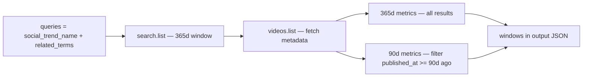

# YouTube Validator — M1a

`collectors/youtube.py` — implemented and ready to run.

---

## Role in Mini-RAG

Validates whether terms from `terms.json` have measurable video traction on YouTube. Does not discover terms — it measures signal for terms that already came from M0 research.

---

## API access

- **API:** YouTube Data API v3
- **Auth:** API key, read-only
- **Env var:** `YOUTUBE_DATA_API_KEY`
- **Quota:** 10,000 units/day (free tier)
- **Unit costs:** `search.list` = 100 units · `videos.list` = 1 unit

---

## Collection flow



Single search pass per term: the 365d window covers both tracks. The 90d subset is derived by filtering `published_at` — no extra API calls needed.

`relevanceLanguage="en"` ensures results are English-language content (US/UK/AU channels where health trends originate).

---

## Window logic

Both windows are produced in every run from the same API call:



M2 and M3 decide what's hyped vs emerging — the collector provides both windows for that decision.

---

## Quota budget

| Terms | Queries per term avg | Sort orders | Search calls | Units (search) | Units (videos.list) | Total |
|-------|---------------------|-------------|-------------|----------------|---------------------|-------|
| 12 | 4 (1 name + 3 related) | 2 | 96 | 9,600 | ~20 | ~9,620 |

Script prints the estimate before running. Daily limit: 10,000 units. Use `--max-results 25` if close to quota.

---

## Script interface

```bash
python collectors/youtube.py                          # default: data/mock/terms.json
python collectors/youtube.py --terms real_terms.json  # production terms
python collectors/youtube.py --output data/raw/youtube_test.json
python collectors/youtube.py --max-results 25         # reduce quota usage
```

| Argument | Default | Description |
|----------|---------|-------------|
| `--terms` | `data/mock/terms.json` | Input terms JSON |
| `--output` | `data/raw/youtube_YYYY-MM-DD.json` | Output path |
| `--max-results` | `50` | Per search call (API maximum) |

`--window` is not available — both 90d and 365d are always produced.

---

## Output structure

```json
{
  "source": "youtube",
  "collected_at": "2026-04-29T14:00:00Z",
  "windows": ["90d", "365d"],
  "term_count": 12,
  "terms": [
    {
      "term_id": "wolverine-stack",
      "social_trend_name": "Wolverine Stack",
      "underlying_topic": "Peptides",
      "everme_category": "Supplements",
      "queries_used": ["Wolverine Stack", "BPC-157 TB-500", "wolverine protocol peptides", "peptide healing stack"],
      "windows": {
        "90d": {
          "video_count": 23,
          "total_views": 4820000,
          "avg_views_per_day": 18400,
          "top_views_per_day": 48000,
          "videos": [ "..." ]
        },
        "365d": {
          "video_count": 87,
          "total_views": 12400000,
          "avg_views_per_day": 8200,
          "top_views_per_day": 52000,
          "videos": [ "..." ]
        }
      }
    }
  ]
}
```

---

## Metrics explained

### Window-level metrics

| Metric | Formula | What it means |
|--------|---------|---------------|
| `video_count` | count of videos in window | How much content exists — low count = niche or very new |
| `total_views` | sum of all `view_count` | Total attention the term is generating on YouTube |
| `avg_views_per_day` | mean of all `views_per_day` | Average velocity across all videos — platform-wide momentum |
| `top_views_per_day` | max `views_per_day` | Best single video's velocity — identifies breakout content |

### Video-level metrics

| Metric | Formula | What it means |
|--------|---------|---------------|
| `view_count` | raw from API | Total accumulated views (current, not historical) |
| `views_per_day` | `view_count / days_since_publish` | Velocity proxy — most views happen in first 30–60 days |
| `like_count` | raw from API | Positive engagement |
| `comment_count` | raw from API | Discussion depth — high relative to views = controversial or resonant |
| `days_since_publish` | `now - published_at` | Age of the video within the collection window |

### Reading the signals

**Term has strong YouTube signal if:**
- `video_count` ≥ 5 in the 90d window (multiple creators covering it recently)
- `top_views_per_day` > 10,000 (at least one video with real traction)
- Videos from multiple different channels (not one outlier)

**Watch out for:**
- High `top_views_per_day` but low `avg_views_per_day` → one viral video, not a broad trend
- High `video_count` but low `total_views` → many videos, little attention
- All videos from the same channel → creator trend, not platform trend

### Comparing 90d vs 365d windows

| 90d vs 365d | Interpretation |
|-------------|----------------|
| 90d video_count close to 365d | Trend is new — most content created recently |
| 90d much lower than 365d | Trend is older — content slowed down recently |
| 90d top_vpd > 365d avg_vpd | Recent breakout — current momentum higher than historical average |

---

## Known limitations

| Limitation | Impact | Mitigation |
|------------|--------|------------|
| No view history | Can't distinguish growing vs peaked videos | Weekly delta runs; compare `view_count` between runs |
| `search.list` not exhaustive | May miss relevant videos with unusual titles | Use `related_terms` to add search phrases |
| `publishedAfter` approximate | Some out-of-window results | Strict post-fetch filter on `published_at` |
| Tags field often empty | Less metadata for future M3 use | Title + channel covers this |
| 10k quota/day | Can exhaust with many terms | Quota estimate printed at startup; use `--max-results 25` |
