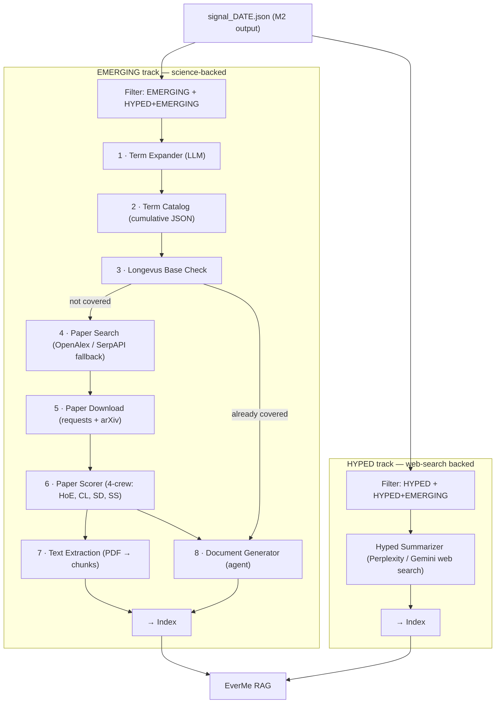

# Plan — Paper Pipeline (`src/paper_pipeline/`)

Module that reads the M2 signal output, processes EMERGING and HYPED terms
through separate tracks, and builds a knowledge base ready for RAG retrieval.

---

## Two-track overview



Terms classified as `HYPED + EMERGING` go through **both** tracks.

---

## Step-by-step: EMERGING track

### Step 1 — Term Expander

**Input:** one EMERGING term record from signal (has `social_trend_name`,
`underlying_topic`, `everme_category`, `related_terms` from terms.json via the
raw collector output).

**What it does:** calls an LLM once per term to decide which of the three
fields — `social_trend_name`, `underlying_topic`, and each item in
`related_terms` — are academically searchable. "Academically searchable" means
the string would return meaningful results on Scopus, Google Scholar, or
OpenAlex. Generic marketing names ("Chinamaxxing", "75 Hotter") are dropped;
specific compounds, methods, or topics ("traditional chinese medicine longevity",
"BPC-157", "continuous glucose monitoring") are kept.

**Output per term:** `{ "term_id": "...", "search_queries": ["q1", "q2", ...] }`

**Module:** `term_expander.py`

---

### Step 2 — Term Catalog

**What it is:** a cumulative JSON file at `src/paper_pipeline/data/catalog.json`
that grows across runs. Each entry records a resolved search query, which parent
term originated it, when it was first added, and how many papers were found on
its last run.

```json
{
  "version": 1,
  "entries": [
    {
      "query": "continuous glucose monitoring dietary optimization",
      "parent_term_id": "cgm-hacking",
      "parent_social_name": "CGM Hacking for Metabolic Personalization",
      "first_seen": "2026-05-11",
      "last_run": "2026-05-11",
      "paper_count": 14,
      "status": "active"
    }
  ]
}
```

**Dedup rule:** before adding a query, normalise to lowercase + strip punctuation
and compare against existing entries. Queries that resolve to the same
normalised string are merged (the older entry wins, `last_run` is updated).

The catalog entry also gains a `longevus_covered` flag once a positive check
is recorded, so future runs skip the check entirely for that query.

**Module:** `catalog.py`

---

### Step 3 — Longevus Base Check

**What it does:** for each search query resolved in Step 1, checks whether the
underlying topic is already covered in the Longevus knowledge base. If it is,
the paper_downloader (steps 5–7) is bypassed entirely — the Document Generator
(step 8) runs directly using whatever is already indexed in Longevus.

**Check mechanism:** ⚠️ open question — depends on how Longevus exposes its
knowledge base. Options in order of preference:
1. Query the Longevus RAG index with the search query and check if any results
   return above a similarity threshold.
2. Look up the `underlying_topic` against a Longevus topic manifest file (if one
   exists).
3. Query the GCS bucket for existing paper metadata files under the topic path.

**What gets recorded:** on a positive match, the catalog entry for that query
is updated with `"longevus_covered": true` and `"longevus_checked": "<date>"`.
This prevents the check from running again on future pipeline runs for the same
query.

**Skip condition:** if `longevus_covered: true` is already in the catalog entry,
skip the check and proceed directly to step 8.

**Module:** `longevus_checker.py`

---

### Step 4 — Paper Search

**Primary:** OpenAlex free API — no key required.
- Search by query string → returns works with metadata, abstract, open-access URL.
- Filters (exact values TBD from longevus reference — see open questions):
  - Publication year range
  - Document types (journal-article, conference-paper)
  - Minimum citation count

**Fallback (if OpenAlex returns < N results):** SerpAPI Google Scholar search →
titles fed back into OpenAlex for full metadata enrichment. Uses `SERPAPI_API_KEY`
env var.

**Output per query:** list of paper dicts with at minimum:
`{ openalex_id, title, doi, year, cited_by_count, is_open_access, oa_url, abstract }`

**Module:** `paper_search.py`

---

### Step 5 — Paper Download

**Strategy (no Selenium):**
1. If `oa_url` is an arXiv URL → use `download_from_arxiv()` (direct requests).
2. If `oa_url` ends in `.pdf` or HEAD returns `content-type: application/pdf`
   → stream download with requests.
3. Otherwise → skip (do not attempt scraping).

Papers are saved to `src/paper_pipeline/data/papers/<openalex_id>.pdf`
(gitignored). If the file already exists, skip the download (idempotent).

**Based on:** `longevus/src/paper_downloader/tools/paper_download_tools.py`
(`download_from_arxiv`, `download_paper_via_selenium` fast-path logic). Selenium
is explicitly excluded.

**Module:** `paper_downloader.py`

---

### Step 6 — Paper Scorer

Scores each downloaded paper on four scientific quality dimensions.
Text extraction (pdfplumber) is embedded in this phase — no separate module.

| Dimension | Weight | Criteria |
|-----------|--------|----------|
| HoE — Hierarchy of Evidence | 0–30 | Study type quality: meta-analysis > RCT > cohort > case study > expert opinion |
| CL — Conclusions & Limitations | 0–20 | Are conclusions supported by data? Are limitations acknowledged? |
| SD — Study Design | 0–30 | Sample size, randomization, blinding, control groups, methodology rigor |
| SS — Statistical Significance | 0–20 | P-values, effect sizes, confidence intervals, clinical relevance |

**Current implementation (Option B — simplified):**
One LLM call per dimension (4 calls per paper), `response_format=json_object`.
Each call returns `{ score: float, rationale: str }` plus a few key fields per dimension.
Input: full PDF text when available, or title + abstract only (flagged separately).
LLM: `gpt-4.1` — scoring requires genuine reasoning over scientific methodology;
`gpt-4.1-nano` is too weak for this task.

**Output per paper added to papers_meta.json:**
`{ final_score, hoe_score, cl_score, sd_score, ss_score, score_rationale, score_source, scored_at }`
where `score_source` is `"full_text"` or `"abstract_only"`.

**Minimum score threshold:** ⚠️ open question — see below.

**Module:** `paper_scorer.py`

---

> **TODO — Option A: full longevus-style scorer**
>
> The longevus scorer (`longevus/src/paper_score/scorer.py`) uses CrewAI Flows
> with 4 crews running in parallel async. Each crew has 5 sequential agents
> (4 dimension-specific extractors + 1 synthesiser) and extracts 30–50 boolean
> and numeric fields into granular Pydantic models before computing the score.
>
> **Why Option A is better for production:**
> - Scores are directly comparable with longevus (same rubric, same weights)
> - Granular extraction (blinding status, randomisation method, effect size values)
>   enables filtering and auditing beyond the final score
> - Deterministic output (temperature=0, seed=42) is reproducible across runs
>
> **Why we're not doing it now:**
> - 5 agents × 4 crews = 20 LLM calls per paper; at 14 papers that's 280 calls
>   before we've even decided the indexing strategy or score threshold
> - CrewAI dependency adds complexity and version-lock risk
> - The open questions (threshold, index technology) change what fields the scorer
>   needs to export — premature to implement the full extraction schema
>
> **Prerequisites before upgrading:**
> 1. Decide minimum score threshold (open question #1)
> 2. Decide index technology (open question #2)
> 3. Port `longevus/src/paper_score/crews/` adapting away from CrewAI tool wrappers
>
> Reference: `longevus/src/paper_score/scorer.py`, `constants.py`, `crews/HoE/`,
> `crews/CL/`, `crews/SD/`, `crews/SS/`.

---

### Step 7 — Text Extraction & Indexing

**Extraction:** PDF → plain text using a PDF parsing library (pdfplumber or
pymupdf). Text is chunked (strategy TBD — likely 512-token overlapping windows).

**Indexing:** chunks are embedded and stored in the RAG index.
- Index technology: ⚠️ open question — see below.
- Each chunk carries metadata: `openalex_id`, `title`, `year`, `doi`, `query`,
  `parent_term_id`, `score`, `chunk_index`.

**Module:** `text_extractor.py` (PDF → chunks) + `indexer.py` (embed + store).

---

### Step 8 — Document Generator

**What it produces:** a structured Markdown document per EMERGING term that
explains:
- What the trend is and why it is emerging
- Which underlying scientific topics it maps to
- Summary of the key papers found (titles, year, key finding, score)
- Overall evidence quality assessment
- Practical implications for EverMe users

**Agent:** single LLM call with the paper summaries and
the original deep-research signal as context. Not a multi-step crew — a
well-crafted single prompt is sufficient here.

**Output:** saved as `src/paper_pipeline/data/documents/<term_id>_DATE.md`
and also indexed (same index as paper chunks) with metadata
`{ type: "term_summary", term_id, track: "emerging", date }`.

**Module:** `doc_generator.py`

---

## Step-by-step: HYPED track

**Input:** HYPED terms from signal (includes the original deep research context
via `social_trend_name`, `underlying_topic`, `signal_drivers`).

**What it does:** calls Perplexity Sonar or Gemini with web search grounding to
generate a non-scientific, user-facing explanation of the trend. This is
deliberately lighter than the EMERGING track — no papers, no scoring.

**Prompt context includes:**
- `social_trend_name`, `underlying_topic`, `everme_category`
- `signal_drivers` (what platform signals triggered the HYPED classification)
- Instruction to write for a health-conscious consumer audience, not academic

**Output:** Markdown document indexed with
`{ type: "trend_summary", term_id, track: "hyped", date }`.

**Module:** `hyped_summarizer.py`

---

## Module structure

```
src/paper_pipeline/
├── __init__.py
├── pipeline.py           # orchestrator — calls each phase in sequence
├── term_expander.py      # phase 1 · LLM query extraction per EMERGING term
├── catalog.py            # phase 2 · ingest expansion into catalog.json
├── longevus_checker.py   # phase 3 · check if topic already covered in Longevus
├── paper_search.py       # phase 4 · OpenAlex search + SerpAPI fallback
├── paper_downloader.py   # phase 5 · download PDFs (requests + arXiv, no Selenium)
├── paper_scorer.py       # phase 6 · 4-crew scorer (HoE, CL, SD, SS)
├── doc_generator.py      # phase 7 · per-term synthesis document (EMERGING)
├── hyped_summarizer.py   # phase H · web-search summary (HYPED)
├── plan.md               # this file
└── data/
    ├── catalog.json      # cumulative query registry (committed, grows over time)
    ├── expansions/       # term_expander output — expansion_DATE.json (gitignored)
    ├── papers/           # downloaded PDFs (gitignored)
    └── documents/        # generated Markdown docs (gitignored)
```

> `catalog.py` also exports the `Catalog` class, used by `paper_search` and
> `longevus_checker` as a shared data layer to read pending queries and write
> back results. Phases still run sequentially — the class is shared logic only.

---

## Phase I/O contracts

Each phase is autonomous: it reads from a well-defined input file and writes to
a well-defined output file. `pipeline.py` calls them in sequence via subprocess.

| Phase | Module | Reads | Writes |
|-------|--------|-------|--------|
| 1 | `term_expander.py` | `signal_DATE.json` | `data/expansions/expansion_DATE.json` |
| 2 | `catalog.py` | `expansion_DATE.json` | `data/catalog.json` (new entries) |
| 3 | `longevus_checker.py` | `data/catalog.json` | `data/catalog.json` (`longevus_covered` flag) |
| 4 | `paper_search.py` | `data/catalog.json` | `data/papers_meta.json` + `catalog.json` (`paper_count`) |
| 5 | `paper_downloader.py` | `data/papers_meta.json` | `data/papers/*.pdf` |
| 6 | `paper_scorer.py` | `data/papers/*.pdf` + `papers_meta.json` | `data/papers_meta.json` (scores added) |
| 7 | `doc_generator.py` | `data/papers_meta.json` + `signal_DATE.json` | `data/documents/<term_id>_DATE.md` |
| H | `hyped_summarizer.py` | `signal_DATE.json` | `data/documents/<term_id>_DATE.md` |

**CLI:**
```bash
# Full run
python src/paper_pipeline/pipeline.py \
  --signal src/trend_radar/data/output/signal_2026-05-13.json

# Partial run — skip phases already completed
python src/paper_pipeline/pipeline.py \
  --signal signal.json --skip-longevus --skip-scorer

# Development — run only the expander
python src/paper_pipeline/pipeline.py \
  --signal signal.json --skip-catalog --skip-longevus --skip-search \
  --skip-download --skip-scorer --skip-docgen --skip-hyped
```

---

## Environment variables (new)

| Variable | Used by | Status |
|----------|---------|--------|
| `SERPAPI_API_KEY` | `paper_search.py` (SerpAPI fallback) | not yet obtained |
| `PERPLEXITY_API_KEY` | `hyped_summarizer.py` | already in deep_research |
| `OPENAI_API_KEY` | all LLM calls (term_expander, doc_generator, paper_scorer) | ✓ already in .env |

`MINIRAG_BUCKET` (GCS) — only needed if index lives in GCS; TBD.

---

## Future discussions

| # | Topic | Detail |
|---|-------|--------|
| 1 | **Term expander — clinical condition coverage** | The `concept` query type should reliably surface established clinical conditions (e.g. "Cushing's syndrome" for cortisol face). With `temperature=0.1` the model is still non-deterministic and may omit them. Options: (a) two-pass prompt — first generate free queries, then explicitly ask "does this trend map to a known clinical condition?"; (b) a post-processing step that looks up the `underlying_topic` in a curated condition dictionary. Trade-off: (a) doubles LLM calls per term; (b) requires maintaining the dictionary. |
| 2 | **Term expander — query breadth and mechanism coverage** | Observed in production: "Cortisol Face" generated only 3 queries (`cortisol facial swelling`, `cortisol and facial edema`, `HPA axis dysregulation`), all either too clinically narrow or too broad, resulting in 0 usable papers after download. The core problem is that the expander maps the trend name literally rather than reasoning about the **underlying physiological mechanisms** being claimed. For cortisol face those mechanisms include: cortisol-driven fat redistribution (central/facial adiposity), glucocorticoid effects on water retention and skin, chronic stress → elevated cortisol physiology, and the Cushing's phenotype as an extreme clinical analogue. None of these were captured. The `related_terms` from the signal (`high cortisol symptoms face`, `cortisol reduction protocol`, `puffy face cortisol`) were also not used as query seeds. **Proposed fix:** expand the term expander prompt to explicitly ask the LLM to (1) identify the biological mechanism being claimed by the trend, (2) generate queries from the mechanism not just the trend name, (3) use each `related_term` as a query seed if it contains academic vocabulary, and (4) produce at least one query from the clinical literature that represents the extreme/pathological version of the trend (which has the most published research). Aim for 5–8 queries per term instead of 3. |

---

## Open questions (decisions needed before implementation)

| # | Question | Impact |
|---|----------|--------|
| 1 | **Minimum paper score threshold** — papers below X are dropped from indexing. What is X? | Determines index quality vs coverage tradeoff |
| 2 | **Index technology** — Pinecone, Weaviate, GCS + local embeddings, or other? | Defines entire `indexer.py` implementation |
| 3 | **Same or separate indexes for HYPED vs EMERGING?** | Affects RAG retrieval strategy downstream |
| 4 | **Paper filters from longevus** — exact year range, doc types, min citations to carry over | Affects `paper_search.py` filter params |
| 5 | **Chunk strategy** — size (tokens), overlap, by-section or sliding window? | Affects retrieval quality |
| 6 | **Embedding model** — OpenAI `text-embedding-3-small`, Gemini, or other? | Tied to index technology choice |
| 7 | **Longevus base check mechanism** — how does Longevus expose its knowledge base for lookup? (RAG query, topic manifest, GCS path scan?) | Defines entire `longevus_checker.py` implementation |

---

## Longevus references to import from

| longevus file | Used for |
|---------------|---------|
| `src/paper_downloader/tools/openalex_tools.py` | `fetch_openalex_papers_from_title`, `convert_inverted_abstract`, `unique_authors_from_papers` |
| `src/paper_downloader/tools/paper_download_tools.py` | `download_from_arxiv`, direct requests fast-path |
| `src/paper_score/scorer.py` | `PaperScorerFlow`, `ScorerState` |
| `src/paper_score/crews/HoE/` | Hierarchy of Evidence crew |
| `src/paper_score/crews/CL/` | Conclusions & Limitations crew |
| `src/paper_score/crews/SD/` | Study Design crew |
| `src/paper_score/crews/SS/` | Statistical Significance crew |
| `src/paper_score/constants.py` | Prompts for all four crews |

Code will be adapted (not copied as-is) — CrewAI tool wrappers removed where
not needed, Selenium references excluded.
